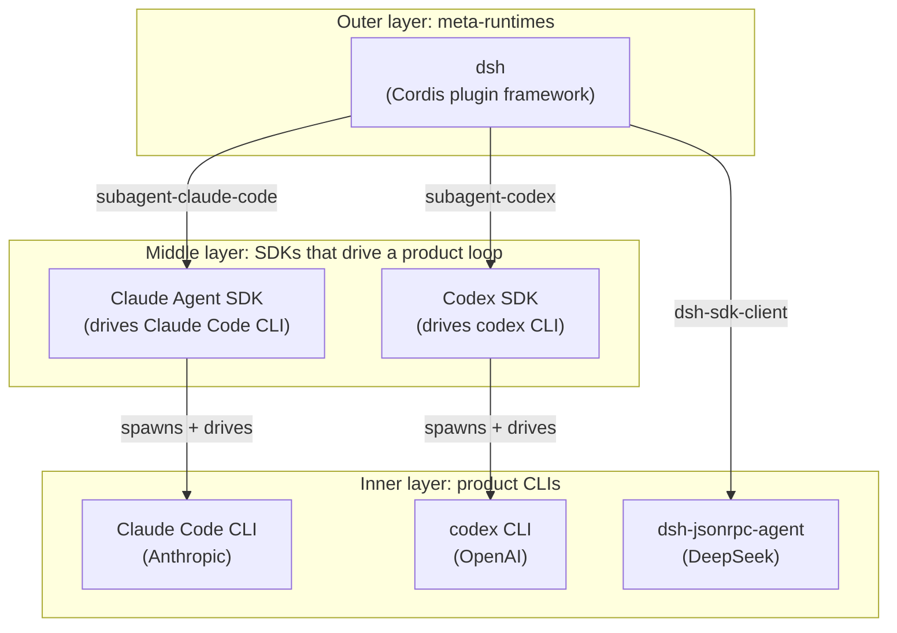
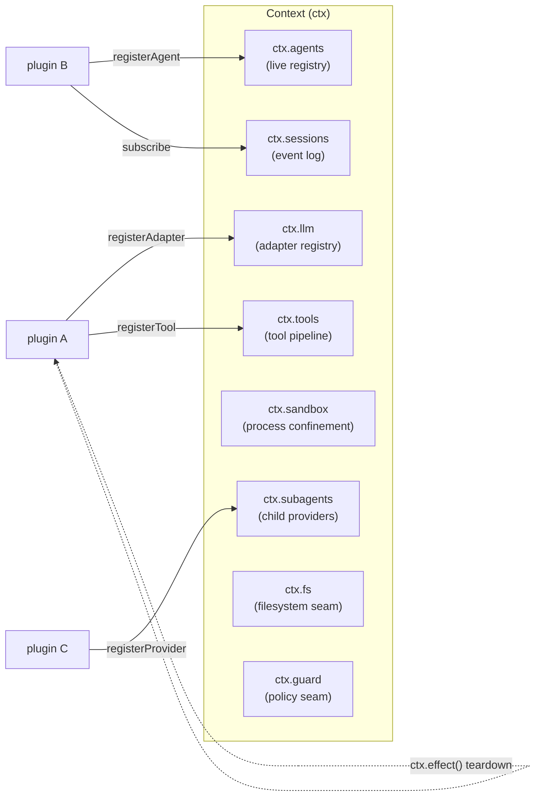
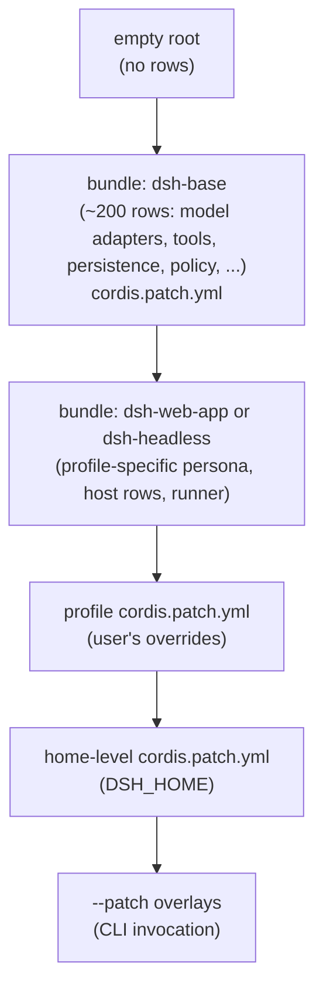

# dsh SDK vs Claude Agent SDK vs Codex SDK — full feature comparison

> Snapshot date: 2026-08-14. Authoritative versions probed on that date:
> `@deepseek-ai/dsh-sdk-client` 0.1.0-rc.5 (TS), `deepseek-harness-sdk` 0.0.0.dev0 (Python);
> `@anthropic-ai/claude-agent-sdk` 0.3.231 (TS), `claude-agent-sdk` (Python) tracked at
> `anthropics/claude-agent-sdk-python`; `@openai/codex-sdk` 0.147.0 (TS) — `codex_sdk` (Python) shipped from the same monorepo.
>
> Where a feature is beta/preview/experimental, this doc marks it explicitly. "Stable" below means
> shipped in a tagged release and not annotated as `@alpha` / `@beta` / "Experimental" in source.
>
> All three SDKs share a single architectural pattern: **the SDK is a thin client around a CLI
> subprocess; the CLI is the real agent**. The interesting differences live in *how that
> subprocess is launched, what protocol flows over its transport, and what the CLI is allowed
> to do.*

## 0. The most important reframing

**dsh is not in the same category as Claude Agent SDK or Codex SDK.** It is in a *parent* category — a meta-runtime that *contains* Claude Code and Codex as subagent backends, not as competitors.

- `packages/subagent/subagent-claude-code` lets dsh spawn a real Claude Code child agent (via the official Claude Agent SDK) from inside a dsh session.
- `packages/subagent/subagent-codex` lets dsh spawn a real Codex child agent (via `codex app-server --stdio`) from inside a dsh session.
- `packages/subagent/subagent-dsh-sdk` lets dsh spawn a dsh child agent (via this very SDK) from inside a dsh session.
- `packages/subagent/subagent-acp` lets dsh spawn any ACP-compatible child.

So the comparison is really three concentric layers:



This is the single most important architectural fact in the comparison. If you adopt dsh, you do not necessarily *replace* Claude Agent SDK — you can use it *as a backend* inside a dsh session. The same is true of Codex. The decision to use dsh is the decision to *compose*, not the decision to *substitute*.

## 1. Position in the ecosystem

| | **dsh SDK** | **Claude Agent SDK** | **Codex SDK** |
|---|---|---|---|
| Vendor | DeepSeek AI | Anthropic | OpenAI |
| What ships in the SDK | A pure library that spawns a runtime; the runtime is whatever `cordis.yml` you hand it | Library that spawns the **Claude Code CLI** (`@anthropic-ai/claude-code`), which is bundled with the package | Library that spawns the **`codex` CLI** from `@openai/codex`; the CLI is a separate package |
| What you talk to | a "complete harness" process whose composition is **yours** | Claude Code CLI (Anthropic's product loop) | `codex` CLI (OpenAI's product loop) |
| Model binding | **Decoupled** — `ctx.llm` is a seam, `cordis.yml` decides the adapter (DeepSeek / OpenAI / Anthropic / pi-ai / local) | **Bound to Claude** (Sonnet/Opus/Haiku) | **Bound to OpenAI** (GPT-5 family) |
| Can spawn its sibling as a subagent? | ✅ Yes (Claude Code, Codex, ACP, recursive dsh) | ❌ No (Claude Code is the only loop) | ❌ No (Codex is the only loop) |
| Stated maturity | `0.1.0-rc.5` — **developer preview, will break** | `0.3.231` — "parity with Claude Code v2.1.231", generally available | `0.147.0` — stable; tracks `codex` CLI |
| License | MIT (`@deepseek-ai/dsh-sdk-client`), MIT (`deepseek-harness-sdk`) | Anthropic Commercial Terms of Service (not OSI) | Apache-2.0 |
| Repo | github.com/deepseek-ai/deepseek-harness | github.com/anthropics/claude-agent-sdk-typescript (TS) + anthropics/claude-agent-sdk-python (Py) | github.com/openai/codex (mono: CLI + TS + Python SDK) |

**Net:** dsh SDK is *runtime-replaceable* AND *runtime-composable*; the other two are *model-replaceable inside a fixed loop*.

## 2. Package and language surface

| | dsh SDK | Claude Agent SDK | Codex SDK |
|---|---|---|---|
| TypeScript package | `@deepseek-ai/dsh-sdk-client` (peer: `@deepseek-ai/dsh-sdk-protocol`) | `@anthropic-ai/claude-agent-sdk` | `@openai/codex-sdk` |
| Python package | `deepseek-harness-sdk` (peer: `deepseek-harness-runtime-bin`) | `claude-agent-sdk` (PyPI) | `codex_sdk` (PyPI) |
| Runtime peer dependency | TS: caller-owned (no bundled binary in npm). Python: bundled platform binary wheel | Both: bundles Claude Code CLI | TS/Py: requires `codex` CLI on `PATH` (or via `@openai/codex`) |
| Minimum engine | TS: ESM, Node 18+ | TS: Node 18+; Py: Python 3.10+ | TS: Node 18+; Py: Python 3.10+ |
| Sub-protocol packages | `dsh-sdk-protocol` (wire types), `dsh-sdk-jsonrpc-server` (server plugin) | none — SDK is monolithic | none — SDK is monolithic |

## 3. The framework underneath (only dsh has one)

dsh is built on **Cordis**, a vendored plugin framework. This is the structural difference that lets dsh do things the other two cannot.



Cordis in five ideas (per `docs/cordis-primer.md`):

1. **A plugin is a `Service`** — a function with optional `inject` and `apply(ctx)` fields, or a `Service` subclass.
2. **A context is a repository of services.** Plugins claim a stable `ctx.<key>` (e.g. `ctx.tools`, `ctx.llm`); other plugins find services via key, not by import.
3. **Dependency is declared via `inject`.** Load order is expressed through service requirements, not boot sequencing.
4. **Typed events for communication.** `emit` / `waterfall` / `parallel` / `serial` dispatch modes, chosen per event.
5. **Registrations are reversible effects.** `ctx.effect()` and `ctx.on()` produce disposers; reload and teardown unwind predictably.

**Claude Agent SDK and Codex SDK do not have a plugin framework.** They are libraries that wrap a CLI. The "framework" inside them is the CLI itself — a single Rust/Node binary whose behavior is configured but not composed.

The four dispatch modes are the crucial detail:

| Mode | Awaited? | Order | Has return value? |
|---|---|---|---|
| `emit` | no | registration order | no |
| `waterfall` | no | registration order | yes (one listener can short-circuit by returning without `next()`) |
| `parallel` | yes | all listeners in parallel | no |
| `serial` | yes | registration order | yes |

A policy listener (e.g. `tools/execute` deciding whether a tool call is allowed) uses waterfall because a single decision is the goal. A telemetry listener uses `emit` because it only observes. A fan-out (e.g. distributing an event to multiple storage backends) uses `parallel`. An ordered reducer uses `serial`.

## 4. Transport and protocol

| | dsh SDK | Claude Agent SDK | Codex SDK |
|---|---|---|---|
| Transport | **stdio**, newline-delimited JSON-RPC 2.0 | stdio, **stream-json** (NDJSON; control protocol on a separate channel) | stdio, **JSONL events** |
| What flows on the wire | every durable `SessionEvent` (full session log) + `session.status` + `subagent.started` / `subagent.finished` | `user`, `assistant`, `system/init`, `result`, `tool_result`, plus `stream_event` mirror of CLI | `thread.started`, `turn.started`, `item.completed`, `turn.completed` |
| Wire-stable identifier | `serverInfo.name = "deepseek-harness-sdk-runtime"` | (CLI parity — `system/init` carries `claude_code_version`) | (CLI version via `thread.started`) |
| Methods / messages (TS API) | `initialize` / `session/prompt` / `shutdown` | `query({ prompt, options })` returns `AsyncIterable<SDKMessage>`; `ClaudeSDKClient` for bidirectional | `Codex` class: `startThread()` / `resumeThread(id)` / `thread.run()` / `thread.runStreamed()` |
| Bidirectional mode | implicit — keep the client open across `run()` calls, prompt returns `MessageId` immediately | explicit — `ClaudeSDKClient` (in-process MCP tools, hooks) | implicit — keep `Thread` across `run()` calls |
| Notification subscription | `client.subscribe(filter?)`, `client.subscribeSessionTree(id)` (awaitable `next()`, non-blocking `tryNext()`, async iteration) | drive off the `AsyncIterable`; `ClaudeSDKClient.receive_response()` | drive off the `runStreamed()` async generator |
| Cancellation / stop | `client.close()`; subprocess killed via stdin-EOF → SIGTERM → SIGKILL ladder; ladder is private to the client | `client.interrupt()` aborts in-flight turn; `cancel_queued` (capability `interrupt_cancel_queued_v1`) cancels queued + pending | `thread.interrupt()`; `turn.interrupt()` |
| Reconnect semantics | handshake failure → reaps the runtime and swaps in a fresh client; later calls retry on a new subprocess (until `close()`) | (single-process CLI; re-run `query()` if it dies) | (single-process CLI; re-run on a `Thread` if it dies) |

### 4.1 The "Model-visible means logged" invariant (dsh only)

dsh's runtime has a structural invariant that the other two do not encode: **anything that reaches a model request must be reconstructable from the session log**. The session is the source of truth; the model-visible history is *derived* from it. Adding a new model-visible input requires adding a new `SessionEvent` and rendering it from the log. This is why the SDK streams the *full log* to the client, not just deltas.

Claude Agent SDK and Codex SDK stream message/item deltas. You can reconstruct the conversation from them, but the wire is not structured to be the source of truth — it is structured to be the user-visible output.

## 5. Top-level run API

| | dsh SDK | Claude Agent SDK | Codex SDK |
|---|---|---|---|
| High-level "run a prompt" | `await using harness = new DeepSeekHarness({...})`<br>`const result = await harness.run(prompt)` | `async for await (const msg of query({ prompt, options })) { ... }` | `const thread = codex.startThread()`<br>`const turn = await thread.run(prompt)` |
| Result shape | `RunResult { sessionId, finalResponse, finishReason, events, notifications, sessionRoot }` | `AsyncIterable<SDKMessage>` of `user` / `assistant` / `system` / `result` / `stream_event` | `Turn { finalResponse, items, usage }` |
| What `finalResponse` means | **the last committed root-session assistant text** in the activity interval — **not** a causal attribution to the prompt (steering, injected context, queued work may all contribute) | last assistant text in the iteration | `turn.finalResponse` (assembled final text) |
| "Activity interval" semantics | `agent/inbox/spliced` receipt → next whole-agent `idle`. The interval is owned by the caller. | (implicit — the iteration ends when the result message arrives) | turn = one model loop, ends at `turn.completed` |
| Subagent notifications | `subagent.started` / `subagent.finished` streamed; `subscribeSessionTree(sessionId)` scopes lineage; client discovers children from `subagent.started` | `AgentOutput` items in the message stream; `background: true` on forked skills | (subagent surfaces inside `items`; thread is the unit) |
| `await using` / context manager | ✅ TS: `await using`; Python: `with DeepSeekHarness() as h:` | `async with ClaudeSDKClient(options) as client:` | `async with` / scope-bound `Thread` |
| Per-run cap | `maxTokens` (optional positive int) inherited by in-process descendants; compaction summaries keep their own limit | `maxThinkingTokens`, per-tool `max_duration`, sandbox `network.strictAllowlist`, etc. | per-turn `outputSchema`, `--config` overrides |
| Output schema | not in the SDK — dsh delegates to the model adapter / `dsh-system-prompt` | not built-in | **`outputSchema`** (JSON Schema or `zod-to-json-schema` with `target: "openAi"`) |
| Structured input | runtime's `ContentBlock[]` (text / image / tool refs); the SDK passes through | text + image via the prompt | structured input: `[{ type: "text", text }, { type: "local_image", path }]`, images via `--image` |

### 5.1 Code samples, side by side

**dsh (TypeScript):**

```ts
import { DeepSeekHarness } from '@deepseek-ai/dsh-sdk-client'

await using harness = new DeepSeekHarness({
  launch: { command: 'node', args: ['lib/bin.js', 'cordis.yml'] },
  provider: 'deepseek-official',
  model: 'deepseek-v4-flash',
  maxTokens: 49_152,
})
const result = await harness.run('say hi')
console.log(result.finalResponse)
```

**Claude Agent SDK (TypeScript):**

```ts
import { query } from '@anthropic-ai/claude-agent-sdk'

for await (const msg of query({
  prompt: 'say hi',
  options: { model: 'claude-sonnet-4.6', maxThinkingTokens: 8000 },
})) {
  if (msg.type === 'assistant') console.log(msg.message.content)
}
```

**Codex SDK (TypeScript):**

```ts
import { Codex } from '@openai/codex-sdk'

const codex = new Codex()
const turn = await codex.startThread().run('say hi')
console.log(turn.finalResponse)
```

## 6. Configuration, extension, and "what can I swap?"

| | dsh SDK | Claude Agent SDK | Codex SDK |
|---|---|---|---|
| Configuration style | **`cordis.yml` + patch layers** (bundle patches → profile `cordis.patch.yml` → home-level → `--patch`); row-targeted replace/insert | **`ClaudeAgentOptions` + `Settings`** (JSON), `system_prompt`/`append_system_prompt`, `mcp_servers`, `allowed_tools`, `can_use_tool`, `permission_mode`, `setting_sources` | **`Codex` constructor `config` + `startThread` options**; CLI `--config key=value` overrides (TOML-literal) |
| Swap the model loop | **Yes** — every component (loop, tools, persistence, model adapter) is a Cordis plugin; the loop is `core/agent-loop` and is a swappable `Agent` impl | No — Claude Code's loop is the only loop | No — Codex's loop is the only loop |
| Add a model provider | register a `ctx.llm` adapter in a plugin | No — Claude only | No — OpenAI only (configurable `baseUrl`) |
| Add a tool | register on `ctx.tools`; its schema joins prompt assembly | `allowed_tools` allowlist; new tools via in-process MCP or external MCP server | new tools via external MCP server (Codex has no in-process SDK MCP today) |
| Patch an existing capability row | **`cordis.patch.yml`** targets a row by id, replaces its whole config | `extraArgs`, `flagSettings`, `applyFlagSettings({...})` (apply at runtime) | `--config` overrides per-thread / per-Codex-instance |
| Custom in-process MCP tools | runtime can mount any plugin; an MCP server is one plugin among many | ✅ `create_sdk_mcp_server(name, version, tools=[...])` with `@tool` decorator; runs in same Python process | ❌ external MCP only |
| Persistent terminal / PTY | `dsh-tool-terminal` + `ctx.terminals` backend (plugin) | built-in (`Bash`, `BashOutput`, `KillShell`, `BashWithSandbox`) | built-in (`exec_command`, `shell_command`, `update_plan`) |
| File system backend | `ctx.fs` provider (local, remote, in-memory) | `Read` / `Write` / `Edit` / `Glob` / `Grep` / `NotebookEdit` | `apply_patch` (proposed → applied) |
| LSP | registered on `ctx.lsp` (plugin) | (delegated to the model; no first-class LSP seam) | (delegated to the model) |
| Sandboxing | `ctx.sandbox` backend; consumers wrap argv before spawning; E2B-style remote providers live behind this seam | sandbox: `sandbox: 'worktree'`, `network.strictAllowlist`, `filesystem.autoAllowDirectories`, `awsPairs`/`sigv4` credential re-signing, `decode: 'jwt'`, `maskClaims` | sandbox: `sandbox_workspace_write.network_access`, `sandbox: 'danger-full-access'` etc. via `--config` |
| Hooks | `ctx.hooks` runtime event; `dsh-hook-protocol-lib`; `dsh-hook-bridges` (`hooks-claude-code`, `hooks-codex`); lifecycle events SessionStart, PreToolUse, PostToolUse, UserPromptSubmit, Stop, SubagentStop, Notification, PreCompact, SessionEnd | `PreToolUse`, `PostToolUse`, `UserPromptSubmit`, `Notification`, `Stop`, `SubagentStop`, `SessionStart`, `SessionEnd`, `PreCompact` via `settings.hooks` (and SDK `register_hooks` in Python) | not a first-class SDK concept (driven by `config.toml` and a small set of `notify`/`webhook` events) |
| Skills / slash commands | `dsh-skill` + `extensions`; profile-deployed | `.claude/skills/` + `.claude/commands/`; `add_dir`, `setting_sources = ["project","user","local"]`; `skills: 'all'` enables every skill | `~/.codex/skills/` (skills system); prompt-based slash commands via the CLI |

### 6.1 The dsh patch layering, concretely

This is the most important dsh concept the comparison doc has to convey, because nothing else in the SDK ecosystem has an equivalent.



Each layer can:

- **replace** an existing row by id (whole-config replace; no deep-merge)
- **insert** a new row

Layers apply in order, with later layers winning. The same row id appearing in `dsh-base` and the user's `cordis.patch.yml` ends up with the user's config. The example in `packages/bundle/base/README.md` is the platform-specific shell stack: `bash-sandbox`/`tool-bash` are `disabled` on win32, `pwsh-sandbox`/`tool-pwsh` are `disabled` on POSIX, both gated inside the same patch file by `!!js process.platform`.

**Claude Agent SDK's nearest equivalent** is `flagSettings` + `applyFlagSettings({...})` applied at runtime, but it does not target rows; it sets flag values on the CLI. The closest deep-merge is `Settings` in `ClaudeAgentOptions` (JSON in TS, but only specific keys; Claude Code's settings.json structure is more permissive than the SDK's typed surface).

**Codex SDK's nearest equivalent** is `--config key=value` overrides. Dotted paths, TOML-literal serialization. Per-Codex or per-thread.

## 7. Session, persistence, and resume

| | dsh SDK | Claude Agent SDK | Codex SDK |
|---|---|---|---|
| Session log = source of truth | yes — `SessionEvent` is the log; `deriveMessages()` projects the model history | messages stream | items stream + thread file |
| Persistence backend | JSONL session log + composable persistence plugin; compaction is a **capability seam** | session log file (CLI-managed) | `~/.codex/sessions/<id>.jsonl` (CLI-managed) |
| Resume | `session(id)` opens a named session; `subscribeSessionTree(id)` scopes notifications to descendants discovered from `subagent.started` lineage | `query({ resume: '<sessionId>' })`; `resumeSessionAt` + `resumeDropsTurn` for truncating resume | `codex.resumeThread(threadId)` |
| Fork | session log is replayable; fork is a derived view | `query({ resume, forkSession: true })` | (no explicit fork in SDK) |
| Compaction | `dsh-compaction` is a capability seam (`compaction-capability-seam`); proposed `recallable-compaction` (2026-07-06) adds recall hooks | `PreCompact` hook event; `compact()` control request (some versions) | automatic (model-side) |
| Truncating resume guard | n/a (log is full) | `resumeDropsTurn` declares the turn a truncating resume intends to drop; CLI refuses if anything else would be discarded | n/a |
| Cross-project session leakage fix | n/a (sessions are runtime-scoped) | ✅ fixed in 0.3.224: long (>200 char) project paths no longer cross projects under a shared sanitized prefix | n/a |
| Relational invariants | `dsh-session/invariant` registers monotonic sequence numbers, turn/step enclosure, same-step tool call/result pairing | none published | none published |

### 7.1 dsh session model — what makes it different

Per `packages/core/session/README.md`:

- The session is event-sourced: every fact that reaches the model is a `SessionEvent` in the log. `deriveMessages()` projects the model history from the log on demand.
- A `Session` is a plain class (not a Cordis Service). The store, `ctx.sessions`, is a Cordis Service.
- A `Surface` is an ordered projection of message-producing events, maintained on top of the raw log for efficient derivation and compaction.
- The session exposes `session.surface` (a readonly `SessionSurface` view) and `replaceGeneration` (incremented on every committed rewrite). The event cache (`session.events`) is a frozen snapshot invalidated by append.
- A surface rewrite rebuilds the projection; there is no raw-log fallback. This means the wire protocol can stream a fresh surface on demand.
- `SessionFork` selects a seed through the inclusive `boundary` event seq (default: current last event) and requires the prefix to end outside an open turn.
- `dsh-agent-loop` uses a split lifecycle (prepare → enter → announce) so the final loop flush precedes session detach. This is the "ownership" pattern.

Claude and Codex do not have this surface/projection split. They stream messages/items directly. dsh's split exists because the session log is the source of truth; everything else (model history, tool results, compaction inputs) is a *projection* of it.

## 8. Subagent / multi-agent

| | dsh SDK | Claude Agent SDK | Codex SDK |
|---|---|---|---|
| Subagent concept | yes — `core/subagent`; can delegate to a fresh child agent **or** to another product's turn; provider names, child ids, and durable lineage never establish locality | yes — `Agent` tool (Task), `background: true` forked skills | yes — subagent is a thread; subagent surfaces in `items` |
| Provider registry | `ctx.subagents` — multiple named providers coexist in one context; shipped: `subagent-spawn-in-process`, `subagent-fork-in-process`, `subagent-acp`, `subagent-codex`, `subagent-claude-code`, `subagent-dsh-sdk` | implicit — only the in-process `Agent` tool | implicit — only a thread |
| **Spawn a Claude Code child from inside a dsh session** | ✅ via `subagent-claude-code`; uses the official Claude Agent SDK under the hood | ❌ not applicable | ❌ not applicable |
| **Spawn a Codex child from inside a dsh session** | ✅ via `subagent-codex`; uses `codex app-server --stdio` | ❌ not applicable | ❌ not applicable |
| **Spawn a dsh child from inside a dsh session** | ✅ via `subagent-dsh-sdk` (recursive) | ❌ not applicable | ❌ not applicable |
| **Spawn an arbitrary ACP child** | ✅ via `subagent-acp` (works with any Agent Client Protocol server) | ❌ | ❌ |
| Depth cap | configurable per plugin | lowered to **1** in 0.3.217; set `CLAUDE_CODE_MAX_SUBAGENT_SPAWN_DEPTH` to allow deeper | per-thread |
| Concurrency cap | runtime-enforced per session | ✅ added in 0.3.217: default 20, override `CLAUDE_CODE_MAX_CONCURRENT_SUBAGENTS` | per-thread |
| Backpressure on background shells | n/a | ✅ 0.3.225: background subagents in headless/SDK sessions now resume when a background shell/Monitor they left completes | n/a |
| Cross-session messaging | proposed (`interactive-side-sessions` 2026-07-08) | `crossSessionInbound` (default deny → held for approval); `dialogExpiry`; `SendMessage`; `subkind: 'peer-send-message'` on `task-notification` | (no SDK concept) |
| Notification scoping | `subscribeSessionTree(id)` (client-side, includes discovered descendants) | drive off the stream | drive off the stream |
| In-process descendants | share `maxTokens`; separate compaction summary | share `maxThinkingTokens` | separate per turn |

### 8.1 dsh subagent family (the unique selling point)

From `packages/subagent/README.md`, the dsh subagent capability family is the only one in this comparison where the SDK has a *registry* of subagent backends, and the backends include the competitors' own CLIs as first-class children.

| Provider | What it spawns | Where the child runs |
|---|---|---|
| `subagent-spawn-in-process` | a fresh in-process dsh child agent (new session) | same process |
| `subagent-fork-in-process` | an in-process child from the parent's completed history (fork) | same process |
| `subagent-acp` | an out-of-process child over [Agent Client Protocol](https://agentclientprotocol.com) | separate process, stdio JSON-RPC |
| `subagent-codex` | a real `codex app-server --stdio` child | separate process |
| `subagent-claude-code` | a real Claude Code child through the official Claude Agent SDK | separate process |
| `subagent-dsh-sdk` | an out-of-process dsh child through this very TypeScript SDK | separate process |
| `tool-subagent` | exposes delegation to the model (a `subagent` tool) | one row per provider |
| `tool-subagent-control` | exposes child messaging and listing to the model | per provider |
| `tool-subagent-report` | the child-to-parent report channel | child scopes |

**Implication:** in dsh, a model can decide to delegate to *any* of these backends in the same session, with the same `subagent` tool, configured by Agent Presets. A single dsh session can host Claude Code subagents *and* Codex subagents *and* dsh subagents simultaneously, each isolated and reported back through the same lineage tree.

## 9. Tools, code execution, and shells

| | dsh SDK | Claude Agent SDK | Codex SDK |
|---|---|---|---|
| Tool pipeline | `ctx.tools` registry → `tools/pre-execute` → `tools/execute` → `tools/post-execute` waterfalls; `agent/pre-step` rewrites or rejects | `PreToolUse` → tool → `PostToolUse`; `can_use_tool` async callback for runtime decisions | tool dispatcher; permission decisions via `approval_policy` / `sandbox_policy` |
| Built-in tools | whatever your `cordis.yml` mounts; `dsh-base` ships a default set (bash, file ops, search, todo, etc.) | Read, Write, Edit, MultiEdit, Glob, Grep, NotebookEdit, WebFetch, WebSearch, Bash, BashOutput, KillShell, TodoWrite, Agent, Skill | `exec_command`, `shell_command`, `apply_patch`, `update_plan`, MCP-loaded tools |
| Plan tool | `todo-write-tool` (2026-06-29) | `TodoWrite` | `update_plan` |
| Background commands | jobs service (`ctx.jobs`); `job_*` tools; `background-job-completion-wakes-an-idle-owner` (2026-08-11) | `Bash` w/ `run_in_background: true`; `BashOutput`/`KillBash` | `exec_command` w/ `background: true` |
| Stream detachment detection | n/a (subprocess stdio is owned by SDK) | n/a | n/a |
| Sandbox timeouts | per-tool timeout config | `Bash` `max_duration_ms`; `timedOutAfterMs` reported on `BashToolOutput` | per-tool |
| Cancellation | cooperative, quiescent; `AbortSignal`; `ABORTED_BEFORE_DISPATCH` vs `ABORTED`; `TOOL_TIMEOUT` is its own reason; pre-aborted entries materialize and freeze arguments then skip policy and dispatch | `interrupt()` aborts; aborted assistant messages carry `aborted: true` (0.3.214) | `interrupt()` |

### 9.1 dsh tool execution model

Per `packages/core/tools/README.md` (the most detailed doc in the SDK):

- `ToolDefinition` = `ToolSchema` + mandatory `output { schema, render, presentationMeta? }` + `execute(args, exec)`, optional final-content and presentation callbacks, cooperative `timeoutMs`, optional per-call `isConcurrencySafe(args)`.
- The body returns only the canonical JSON value declared by the output schema and cooperatively stops through `exec.signal`.
- `finalizeContent(exec, result)` runs exactly once for every normalized result, including failures that bypass post-policy, and can replace only `content`; it must be synchronous and total.
- `ToolExecutionInput` = `{ callId, name, arguments, signal, agent?, parent? }`; `signal` is required and readonly.
- `ToolExecutionToken` = a fresh branded `Symbol`. Equality correlation only; never crosses a model/log/worker boundary.
- `ToolExecutionResult` is discriminated: success = `{ isError:false, value:JsonValue, content, meta?, additionalContexts? }`; failure = `{ isError:true, error:{ message, info? }, content, meta? }` and has no value. `additionalContexts` preserves every deferred or post-execute identified `UserMessage` for the loop's post-result FIFO.
- `PreToolDecision` = `{kind:'allow'}` | `{kind:'deny', reason}` | `{kind:'ask', reason?}`. Input rewrite is deliberately not offered; `ask` is serviced by `ctx.approval` when mounted and otherwise degrades to deny.
- `PostToolDecision`: accept may replace `content` or `value`, never both, and may attach `additionalContexts`; block turns feedback into a valueless failure. Value replacement is revalidated and rerenders content/metadata.

**Three live waterfalls** transform a tool call: `tools/pre-execute` (policy), `tools/execute` (wrapping), `tools/post-execute` (finalization). Then the definition-owned content finalizer. Then the observe-only `tools/result` event.

## 10. Lifecycle, hooks, and observability

| | dsh SDK | Claude Agent SDK | Codex SDK |
|---|---|---|---|
| Lifecycle events | `agent/*` (inbox, step, status, request, validation, continuation, turn-stopping) + `session/*` + `turn/*` + `step/*` + `user/*` + `assistant/*` + `tool/*`; some are waterfalls (call `next()`), `agent/turn-stopping` is serial | `PreToolUse`, `PostToolUse`, `UserPromptSubmit`, `Stop`, `SubagentStop`, `Notification`, `SessionStart`, `SessionEnd`, `PreCompact`; `DirectoryAdded` (0.3.219) | `thread.started`, `turn.started`, `item.*`, `turn.completed`, `error` |
| Structured request | `agent/request` (waterfall) | `control` protocol (initialize, interrupt, `set_permission_mode`, `set_model`, `set_sandbox_policy`, `rewind_files`, `reload_plugins`, …) | n/a (events only) |
| Permission mode | `ctx.guard` + `tools/*` policy events | `permission_mode: 'default' \| 'acceptEdits' \| 'plan' \| 'bypassPermissions' \| 'manual' \| 'delegate' \| 'dontAsk'`; `'manual'` alias accepted at every ingress; `set_permission_mode` rejects unknown modes | `approval_policy` (e.g. `on-request`, `on-failure`, `never`) + `sandbox_policy` |
| Auto-deny on overflow | n/a | bare headless emits `system/permission_denied` events when a tool call is auto-denied (0.3.223) | n/a |
| Telemetry | `ctx.telemetry` + `runtime-diagnostics` plugin | `usage` vs `modelUsage` (modelUsage is cumulative, covers all query-pipeline calls — for cost); per-`modelUsage` entry carries `canonicalModel` + `provider` (0.3.218) | `turn.usage` (`input_tokens`, `cached_input_tokens`, `output_tokens`) |
| Error surface | typed: `JsonRpcResponseError` (wire `code`/`data`), `RequestTimeoutError`, `SdkProtocolError`, `TransportClosedError` (exit code + stderr tail) | exception types in Python; `StopFailure` (`error_details: 'request_body_over_limit: …'`); 529 overload → `api_error_status: 529` on result; result message can include `api_error_status: 429` mid-stream | exception types in TS/Py |
| Process exit diagnostics | n/a (single-process model) | 0.3.211: process-exit errors now include CLI stderr | n/a |

### 10.1 dsh hook bridges (the adoption feature)

dsh ships **hook bridges** for both Claude Code and Codex hook formats (`packages/hooks/`):

- `dsh-hook-protocol/`: shared shell-hook protocol library
- `dsh-hooks-claude-code/`: Claude Code hook bridge (translates `PreToolUse`/`PostToolUse`/etc. from Claude's `hooks.json` shape onto dsh's interception points)
- `dsh-hooks-codex/`: Codex hook bridge (same idea, Codex's hook shape)

This is significant for adoption: **if you already have a `hooks.json` written for Claude Code, dsh can run it as-is** through the bridge, and the bridge translates the external shell-hook protocol onto dsh's native extension points. The native extension surface itself is the harness's typed interception points (per the `interception-extension-points` Agent Note, 2026-06-30); a "native hook" is just an ordinary Cordis plugin on those points.

## 11. Provider, model, and runtime neutrality

| | dsh SDK | Claude Agent SDK | Codex SDK |
|---|---|---|---|
| Default provider | whatever your `cordis.yml` registers; bundled default = `deepseek-official` mounted by the bundled `dsh-jsonrpc-agent` | Claude | OpenAI (configurable `baseUrl`) |
| Provider routes | `provider: 'deepseek-official'` is just a route; you can mount `llm-pi-ai` and pick any pi-ai catalog entry | n/a | n/a |
| Bring-your-own model | yes — write a `ctx.llm` adapter plugin | no (Claude only; model swap = `set_model`) | no (OpenAI only; `--config` for endpoint, not model family) |
| `maxTokens` (output cap) | `initialize.maxTokens` optional positive int; in-process descendants inherit; compaction summary has its own limit | `maxThinkingTokens`, model-side caps | per-turn `--config` |
| Context window management | compaction seam + `recallable-compaction` (proposed) | automatic + `PreCompact` hook | automatic |
| Mid-turn model swap | runtime can re-route | `set_model` via control protocol | n/a |
| `fast_mode_state` / fast mode | n/a | surfaced on `system/init`; `fast_mode_disabled_reason` on result/init (0.3.219) | n/a |

### 11.1 dsh LLM runtime details

Per `packages/llm/llm/README.md` — the dsh LLM runtime is much richer than a one-line "model adapter":

- `ctx.llm.registerAdapter(providers, adapter)` — all-or-nothing; `replace(providers)` validates the full set before swap (no observable gap; a conflict leaves the current routes in place).
- `ctx.llm.registerConfigurableProviders(entries)` — declare routes an adapter can activate through configuration; the handle has `replace(entries)` (a plugin whose declared set follows its config must use `replace`, not dispose+re-register, because the latter strands the directory empty when refused).
- `ctx.llm.registerModelDiscovery(settingsNs, discover)` — offer to interrogate provider endpoints; one offer per namespace.
- `ctx.llm.discoverModels(settingsNs, request)` — ask an endpoint which models it advertises.
- `ctx.llm.resolveModelInfo(provider, model, signal?)` — resolve validated exact-model identity + capacity, output default, reasoning metadata.
- `ctx.llm.prepareCall(config, signal?)` — resolve config + detached context metadata + markers for adapter-supplied defaults, capture adapter registration and immutable retry policy as one cancellable, one-shot call.
- `ctx.llm.stream(options)` — stream as raw chunks (`block-start` / `text-delta` / `reasoning-delta` / `tool-call-delta` / `block-end` / `usage` / `finish`).
- `LlmRuntime` normalizes failures from final adapter selection, sync dispatch, iterator construction, and iteration into the stream protocol's single terminal form: `finish { kind: 'error' | 'aborted', failure }`. A failure after partial deltas may leave content blocks open; consumers discard that incomplete output.
- Message content is `ContentBlockMap`-typed (text, reasoning, tool-call, tool-result); plugins can add block types via declaration merging. **No core block type for multimodal content** — a feature that needs one adds it via the map together with the adapter/UI/compaction support that honors it.
- `assistant.message` carries the provider and model that produced it plus optional adapter-private replay state. Before dispatch, `LlmRuntime` retains that state only when the historical and current provider routes are owned by the same adapter instance.
- `GenerateOptions.purpose` classifies logged auxiliary compaction and session-title calls so adapters apply purpose-specific transport policy.

This is **significantly** more than the "swap the model" surface of Claude Agent SDK or Codex SDK. It is a full LLM runtime.

## 12. Beta / experimental / preview surface

### 12.1 dsh — what is marked experimental or not-yet-stable

| Feature | Status | Where |
|---|---|---|
| Whole product | **Developer preview** — "compatibility-breaking changes will happen" | `README.md` |
| `dsh web` profile | shipped, template | `packages/bundle/web-app` |
| `dsh headless` profile | shipped, template | `packages/bundle/headless` |
| SDK wire protocol | **wire-stable** identifier `deepseek-harness-sdk-runtime`; package `0.1.0-rc.5` | `packages/sdk/protocol` |
| `recallable-compaction` | **proposed** (2026-07-06) | `.agents/notes/proposed/feature/2026-07-06-recallable-compaction.md` |
| `interactive-side-sessions` | **proposed** (2026-07-08) | `.agents/notes/proposed/feature/2026-07-08-interactive-side-sessions.md` |
| `task-surface` | **proposed** (2026-08-04) | `.agents/notes/proposed/feature/2026-08-04-task-surface.md` |
| `pre-tool-input-rewrite` | **proposed** (2026-06-30) | `.agents/notes/proposed/feature/2026-06-30-pre-tool-input-rewrite.md` |
| `client-settings-locale-theme` | **proposed** (2026-07-25) | `.agents/notes/proposed/architecture/2026-07-25-client-settings-locale-theme.md` |
| `domain-kv-storage-and-workspace` | **proposed** (2026-07-24) | `.agents/notes/proposed/architecture/2026-07-24-domain-kv-storage-and-workspace.md` |
| `required-cancellation-through-tool-capability-seams` | **proposed** (2026-07-19) | `.agents/notes/proposed/architecture/2026-07-19-...md` |
| `typed-event-schemas` | **proposed** (2026-06-16) | `.agents/notes/proposed/architecture/2026-06-16-typed-event-schemas.md` |
| `session-projection-and-command-log` | **proposed** (2026-07-27) | `.agents/notes/proposed/architecture/2026-07-27-...md` |
| `storage-root-and-derived-medium-recovery` | **proposed** (2026-07-28) | `.agents/notes/proposed/architecture/2026-07-28-...md` |
| `durable-last-activity-index` | **proposed** (2026-07-29) | `.agents/notes/proposed/architecture/2026-07-29-...md` |
| Python SDK `0.0.0.dev0` | pre-release on PyPI | `python/sdk/pyproject.toml` |
| ACP server | shipped, "Known Limitations" — fresh sessions only, no images/audio/embedded resources, no MCP, no list/resume/fork | `packages/acp/acp/README.md` |

> **How "beta" is signaled in dsh:** there is no `@alpha`/`@beta` annotation in the TS sources. Experimental surface is signaled by:
>
> 1. The `0.1.0-rc.x` version pin (semver pre-release).
> 2. The "Known Limitations and Deferred Work" section in every bundle's README.
> 3. The `.agents/notes/proposed/` directory (notes that are not yet implemented).
> 4. The `.agents/notes/rejected/` directory (notes that were considered and rejected).
> 5. The `.agents/notes/archived/{kind}/` directory (notes frozen at decision time, kept for history).

### 12.2 Claude Agent SDK — what is marked beta / alpha / experimental

| Feature | Status | Where |
|---|---|---|
| Whole SDK | tracked at `0.3.231` ("parity with Claude Code v2.1.231"); generally available | `CHANGELOG.md` |
| Rate-limit message prefix buckets (`USAGE_LIMIT_ERROR_PREFIXES` and siblings) | **`@alpha`** export for classifying rate-limit messages | `0.3.211` |
| `cancel_queued` (interrupt control request) | **opt-in capability** `interrupt_cancel_queued_v1` | `0.3.219` |
| `fast_mode_state` and `fast_mode_disabled_reason` | shipped; behavior surface, not experimental | `0.3.219` |
| `sandbox.network.strictAllowlist` | shipped | `0.3.219` |
| `workflowSizeGuideline` | shipped; advisory | `0.3.219` |
| `DirectoryAdded` lifecycle hook | shipped (control protocol) | `0.3.219` |
| `crossSessionInbound` / `dialogExpiry` | shipped; opt-in | `0.3.224` |
| `Settings.source: 'archive'` (zip-over-HTTPS plugin install) | shipped; opt-in | `0.3.224` |
| `Settings.decode: 'jwt'` / `maskClaims` / `extract` / `onExtractNoMatch` / `awsPairs` / `sigv4` | shipped; opt-in | `0.3.224` |
| `resumeDropsTurn` (truncating resume) | shipped; opt-in | `0.3.223` |
| `system/permission_denied` events in bare headless | shipped | `0.3.223` |
| `api_error_status: 429` mid-stream | shipped (regression fix) | `0.3.218` |
| `api_error_status: 529` for repeated overload | shipped | `0.3.223` |
| `subkind: 'scheduled-trigger'` on `task-notification` | shipped; opt-in metadata | `0.3.214` |
| `subkind: 'peer-send-message'` on `task-notification` | shipped; opt-in metadata | `0.3.224` |
| `effortLevel: 'max'` in `applyFlagSettings` | shipped (type widened) | `0.3.214` |
| `user_message_uuid` / `request_sent_wall_ms` | shipped; opt-in fields | `0.3.216` |
| `tool_result_meta` sidecar (`non_execution_kind`, `user_feedback`) | shipped; opt-in | `0.3.216` |
| `skippedLinks` count on `rewindFiles` | shipped; opt-in | `0.3.216` |
| `timedOutAfterMs` on `BashToolOutput` | shipped | `0.3.210` |
| `subagent_type` / `subagent_retry` on `tool_progress` | shipped; opt-in | `0.3.214` |
| `SessionStart` source `"fork"` (vs `"resume"`) | shipped | `0.3.214` |
| `Settings.plugins[].version` in `system/init` and `reload_plugins` | shipped | `0.3.214` |
| `applyFlagSettings` runtime override of `extraArgs` | shipped | various |
| `CLAUDE_CODE_MAX_SUBAGENT_SPAWN_DEPTH` | shipped env override | `0.3.217` |
| `CLAUDE_CODE_MAX_CONCURRENT_SUBAGENTS` | shipped env override (default 20) | `0.3.217` |
| Background shell resume for subagents | shipped (was a long-standing gap) | `0.3.225` |
| Agent Teams (`CLAUDE_CODE_EXPERIMENTAL_AGENT_TEAMS`) | **experimental env flag**; Lumos passes it through to the sandbox when set, otherwise unset | `0.3.x` (long-standing flag) |

> **How "beta" is signaled in Claude Agent SDK:** the only `@alpha` exports are
> `USAGE_LIMIT_ERROR_PREFIXES` and siblings. Most other items are either "opt-in capability",
> "opt-in field on a stable message", or "stable behavior behind a settings flag". Nothing else
> is annotated alpha/beta at the API surface. The long-running `CLAUDE_CODE_EXPERIMENTAL_AGENT_TEAMS`
> env flag is the most prominent experimental surface and is passed through by downstream code
> (e.g. Lumos's `LUMOS_AGENT_RUNTIME_*` config) only when explicitly enabled.

### 12.3 Codex SDK — what is marked beta / experimental

| Feature | Status | Where |
|---|---|---|
| Whole SDK | `0.147.0`; stable | npm |
| `outputSchema` (structured output, JSON Schema) | stable | README |
| `outputSchema` via Zod (`zod-to-json-schema` with `target: "openAi"`) | stable | README |
| Structured input entries (`text` / `local_image`) | stable | README |
| `env` override for the CLI process | stable | README |
| `config` overrides (TOML literals, dotted paths) | stable | README |
| `skipGitRepoCheck` (skip the safety check that cwd is a git repo) | stable; opt-in | README |
| `workingDirectory` per-thread | stable; opt-in | README |
| `baseUrl` per-Codex | stable; opt-in | README |
| `--image` (image attachments) | stable | README |
| `runStreamed()` async generator | stable | README |

> The Codex SDK README does not currently advertise any `@alpha` / `@beta` exports; experimental
> surface in the underlying `codex` CLI is gated by `--enable` flags and TOML keys rather than
> mirrored in the SDK. Treat anything not in the README as a CLI-side feature.

## 13. Security and sandboxing

| | dsh SDK | Claude Agent SDK | Codex SDK |
|---|---|---|---|
| Filesystem sandbox | `ctx.sandbox` backend (per-session confinement; `sandbox-local` for POSIX ACL; `sandbox-windows-acl` for win32 restricted-token) | `sandbox: 'worktree'`; `filesystem.autoAllowDirectories`; `sandbox.network.strictAllowlist` | `sandbox_workspace_write.network_access`; `sandbox: 'danger-full-access'`; per-policy |
| Network policy | `ctx.sandbox` | `sandbox.network.strictAllowlist` (deterministic host allowlist); `awsPairs`/`sigv4` for AWS re-signing | `sandbox_workspace_write.network_access` |
| Secret handling | runtime-level: `dsh-subprocess` `scrubbedParentEnv`; SDK client replaces the child env entirely (`HarnessClientOptions.env`) | `Settings` `envVars` with `extract` / `onExtractNoMatch`; `decode: 'jwt'` with `maskClaims`; `awsPairs` for AWS; long history redaction | `--config` overrides; per-Codex `env` |
| Subprocess lifecycle | private `stdin-EOF → SIGTERM → SIGKILL` ladder with `disposeEofGraceMs` / `disposeGraceMs` / `shutdownTimeoutMs` | SDK spawns the CLI as a child; `interrupt()` aborts in-flight turn | SDK spawns the CLI as a child; `interrupt()` aborts in-flight turn |
| Subprocess leak on failure | n/a — `HarnessClient.start()` is the only spawner; failed handshake reaps the runtime | ✅ 0.3.208: fixed a per-query resource leak in the SDK's process tracking when spawning the CLI fails | n/a |
| Auth model | SDK is provider-agnostic — auth is the caller's problem (and lives in the runtime's `cordis.yml`) | OAuth / API key on the Claude Code CLI; managed by the CLI | `OPENAI_API_KEY` (or `CODEX_API_KEY`); passed by SDK on top of caller `env` |
| Data collection | none at SDK layer | SDK explicitly collects feedback (code accept/reject + conversation data + `/bug` reports) per Anthropic's Commercial Terms | none at SDK layer (telemetry opt-in via CLI) |
| Token rotation | n/a | redaction in `Settings.plugins`; `extract` / `onExtractNoMatch`; `decode: 'jwt'` with `maskClaims` (0.3.224) | n/a |
| Plugin install over network | n/a (plugins are local) | `Settings.source: 'archive'` for installing plugins from a zip over HTTPS (0.3.224); `url` + optional `sha256` | n/a |

## 14. Performance, scale, and operations

| | dsh SDK | Claude Agent SDK | Codex SDK |
|---|---|---|---|
| Connection overhead | spawn the runtime (Node + Cordis bootstrap + `dsh-base` plugins); one-time at `DeepSeekHarness` open | spawn Claude Code CLI; one-time at `query()` | spawn `codex` CLI; one-time at `startThread()` |
| Reuse across runs | runtime stays owned across `run()` calls (TS: `await using`; Python: `with`) | implicit — keep the async iteration | implicit — keep the `Thread` |
| Health probe on subprocess | handshake `initialize`; on failure, reap + retry once on a fresh subprocess | n/a | n/a |
| Large output handling | log is streamed; `events` / `notifications` arrays; session log is the source | stream-json NDJSON; messages bounded by the CLI's 32 MB request-body limit (429 → `terminal_reason: 'api_error'`, `error_details: 'request_body_over_limit: …'`) | stream JSONL; `outputSchema` enforces a cap |
| Long sessions | n/a in SDK (runtime owns its own session log) | n/a | n/a |
| Long-running background | `ctx.jobs` + `background-job-completion-wakes-an-idle-owner` | `Bash run_in_background: true` + `BashOutput` + `KillBash`; subagent monitor | `exec_command background: true` |
| Cancellation on shutdown | private SIGKILL ladder; `close()` idempotent | `interrupt()` on `ClaudeSDKClient` | `interrupt()` on `Thread` |
| Multi-process safety | subprocess per `DeepSeekHarness`; managed internally | one CLI per `query()` / `ClaudeSDKClient`; `extraArgs` to set `CLAUDE_CODE_MAX_CONCURRENT_SUBAGENTS` (default 20) | one CLI per `Thread` |
| Process / system call budget | dsh's tool execution has its own cooperative budget + `dsh-timeout` deadline library + `ctx.guard` policies (per `packages/guard/timeout-policy`) | per-tool `max_duration_ms` | per-tool |
| Per-turn deterministic-state contract | per-run `durable-last-activity-index` is proposed (2026-07-29) for explicit reseed / replay | `resumeSessionAt` + `resumeDropsTurn` for truncating resume; `api_error_status` fields for structural detection of model-side errors | n/a |

## 15. Developer ergonomics

| | dsh SDK | Claude Agent SDK | Codex SDK |
|---|---|---|---|
| Install | `npm i @deepseek-ai/dsh-sdk-client` (TS) or `pip install deepseek-harness-sdk` (Py) | `npm i @anthropic-ai/claude-agent-sdk` or `pip install claude-agent-sdk` (bundles CLI) | `npm i @openai/codex-sdk` (also installs `@openai/codex` CLI as a peer) |
| First run | `await using harness = new DeepSeekHarness({...}); await harness.run('hi')` | `async for await (const m of query({ prompt })) { ... }` | `const turn = await codex.startThread().run('hi')` |
| Debug visibility | `dsh --profile <name> --dump-config` to inspect the plugin tree before boot | `claude --version`; `system/init` carries `claude_code_version` | `codex --version`; `thread.started` carries it |
| Mocking / test | SDK registers nothing on a Cordis context — easy to swap in a mock `cordis.yml` | `claude_agent_sdk.testing`; mockable `query()` | mockable `Codex` (TS) |
| Examples | `packages/examples/jsonrpc-demo`, `examples/jsonrpc-agent/` | `examples/` (session-stores for postgres/redis/s3) | `sdk/typescript/README.md` |
| i18n / docs | EN + ZH mirrors throughout the repo | EN only | EN only |

## 16. Decision matrix

| If you need… | Use |
|---|---|
| Replace the agent loop, the model adapter, or the persistence layer | **dsh** (it's a harness) |
| Stay on Claude, get Claude Code's full product surface (Bash, plan mode, agent teams, skills, hooks) | **Claude Agent SDK** |
| Stay on OpenAI, ship a simple "codex in a loop" integration with structured output and image inputs | **Codex SDK** |
| A pre-release contract you intend to extend in lockstep with the vendor | **dsh** (provider-agnostic; you own the runtime) |
| Compose Claude Code and Codex in the same session | **dsh** (subagent-claude-code + subagent-codex) — neither sibling can do this |
| A plug-in sandbox, plugin marketplace, or "skills" as a first-class package concept | **dsh** (bundles + cordis.patch.yml) **and** **Claude** (skills + plugins) — Codex is a generation behind here |
| `await using`-style ownership and a hand-rolled dispose ladder | **dsh** (TS `await using` is part of the public API) |
| An official Python package on PyPI that you can pin to a version | **dsh** and **Claude**; Codex's PyPI is `codex_sdk` (also pinned) |
| Bidirectional mode with in-process MCP tools written as decorated functions | **Claude** (`@tool` + `create_sdk_mcp_server`); dsh can mount MCP as a plugin; Codex external only |
| A wire-stable identifier across versions | **dsh** (`serverInfo.name = "deepseek-harness-sdk-runtime"` is documented as wire-stable) |
| A simple integration with a JSON Schema for `finalResponse` | **Codex** (`outputSchema`); dsh and Claude rely on the model's tool/structured-output path |
| Cross-session messaging between agents | **Claude** (`SendMessage`, `crossSessionInbound`); dsh has it **proposed** (`interactive-side-sessions`); Codex does not have an SDK concept |
| An ACP (Agent Client Protocol) automation server | **dsh** (`@deepseek-ai/dsh-acp` is automation-only ACP over stdio JSON-RPC); the others do not ship an ACP server |
| A "Model-visible means logged" invariant in the wire protocol | **dsh** only |

## 17. Cross-cutting risks and gotchas

| | dsh SDK | Claude Agent SDK | Codex SDK |
|---|---|---|---|
| Wire / API churn | tagged `0.1.0-rc.x`; will break | tracks Claude Code CLI; minor every few weeks | tracks `codex` CLI; minor more frequently |
| Vendor lock-in | low — the loop, the model, and the storage are all yours to swap | high — Claude + Claude Code loop | high — OpenAI + Codex loop |
| License friction | MIT | Anthropic Commercial Terms (not OSI) | Apache-2.0 |
| Telemetry defaults | opt-in (per plugin) | **opt-out** — the SDK explicitly collects feedback per Anthropic's terms | opt-in (CLI) |
| Audit / replay | full session log is the source; replayable | full message stream is replayable; `resumeSessionAt` for truncating resume | thread JSONL is replayable |
| Community | Discord (per README) | Discord + official docs | GitHub Discussions |
| Adoption maturity | brand new, dsh-base + dsh-web-app + dsh-headless are the first shipped profiles | mature; widely embedded in CI bots, IDE plugins, internal tools | mature in OpenAI-ecosystem tools |

## 18. Authoritative source links (cited as of 2026-08-14)

- **dsh**
  - Repo: <https://github.com/deepseek-ai/deepseek-harness>
  - TS SDK: <https://www.npmjs.com/package/@deepseek-ai/dsh-sdk-client> (0.1.0-rc.5)
  - Python SDK: <https://pypi.org/project/deepseek-harness-sdk/> (0.0.0.dev0)
  - TS SDK protocol: `packages/sdk/protocol/README.md`
  - TS SDK client: `packages/sdk/client/README.md`
  - TS SDK server: `packages/sdk/server/README.md`
  - LLM runtime: `packages/llm/llm/README.md`
  - Tools: `packages/core/tools/README.md`
  - Agents: `packages/core/agent/README.md`
  - Sessions: `packages/core/session/README.md`
  - Subagent family: `packages/subagent/README.md`
  - Subagent backends: `packages/subagent/subagent-{claude-code,codex,dsh-sdk,acp}/README.md`
  - Hook bridges: `packages/hooks/README.md`
  - ACP server: `packages/acp/acp/README.md`
  - dsh-base bundle: `packages/bundle/base/README.md` + `packages/bundle/base/cordis.patch.yml`
  - dsh-headless bundle: `packages/bundle/headless/README.md`
  - dsh-web-app bundle: `packages/bundle/web-app/README.md`
  - Cordis primer: `docs/cordis-primer.md`
  - Architecture: `docs/architecture.md`
- **Claude Agent SDK**
  - TS SDK: <https://www.npmjs.com/package/@anthropic-ai/claude-agent-sdk> (0.3.231)
  - TS repo: <https://github.com/anthropics/claude-agent-sdk-typescript>
  - Python repo: <https://github.com/anthropics/claude-agent-sdk-python>
  - Python README: <https://raw.githubusercontent.com/anthropics/claude-agent-sdk-python/main/README.md>
  - Changelog: <https://github.com/anthropics/claude-agent-sdk-typescript/blob/main/CHANGELOG.md>
- **Codex SDK**
  - TS SDK: <https://www.npmjs.com/package/@openai/codex-sdk> (0.147.0)
  - Repo: <https://github.com/openai/codex>
  - TS SDK README: <https://github.com/openai/codex/blob/main/sdk/typescript/README.md>
  - Changelog: <https://github.com/openai/codex/releases>
