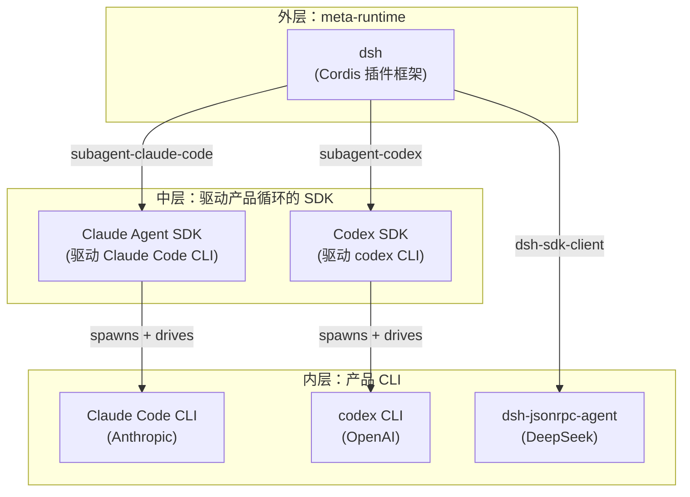
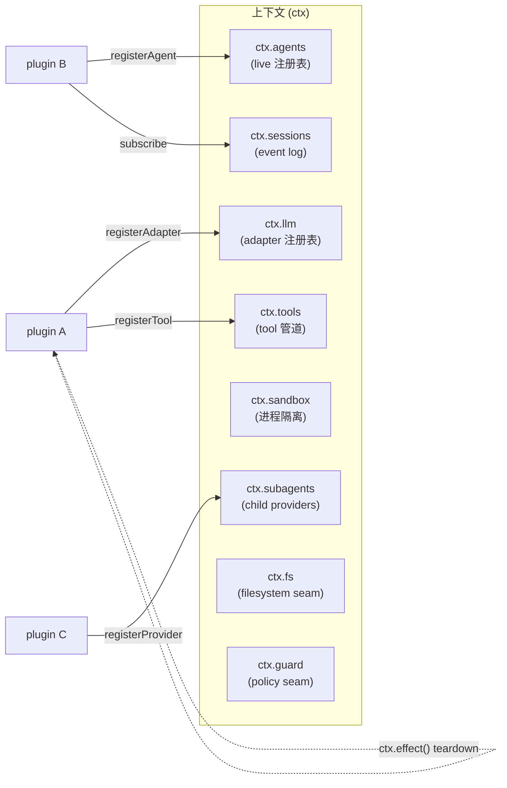
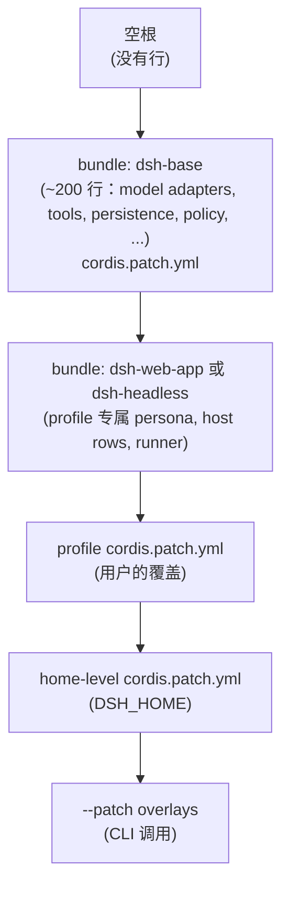

# dsh SDK vs Claude Agent SDK vs Codex SDK — 完整功能对比

> 快照日期：2026-08-14。当日实测的权威版本：
> `@deepseek-ai/dsh-sdk-client` 0.1.0-rc.5 (TS)，`deepseek-harness-sdk` 0.0.0.dev0 (Python)；
> `@anthropic-ai/claude-agent-sdk` 0.3.231 (TS)，`claude-agent-sdk` (Python) 跟踪自
> `anthropics/claude-agent-sdk-python`；`@openai/codex-sdk` 0.147.0 (TS) —— Python 版 `codex_sdk` 由同一 monorepo 出货。
>
> 凡是 beta / 预览 / 实验性功能，本文都显式标注。下文"稳定"指已在带标签的版本中出货，且源码里没有 `@alpha` / `@beta` / "Experimental" 注解。
>
> 三者共用同一套架构模式：**SDK 是 CLI 子进程的薄客户端，CLI 才是真正的 agent**。真正有意思的差异在于 *子进程如何启动、协议在传输层长什么样、CLI 被允许做什么*。

## 0. 最重要的重新定位

**dsh 和 Claude Agent SDK、Codex SDK 并不在同一个类别。** 它在*父*类——一个把 Claude Code 和 Codex 当成 subagent backend 的 meta-runtime，而不是它们的竞争者。

- `packages/subagent/subagent-claude-code` 让 dsh 在 dsh 会话内部派生出真正的 Claude Code 子 agent（通过官方 Claude Agent SDK）
- `packages/subagent/subagent-codex` 让 dsh 在 dsh 会话内部派生出真正的 Codex 子 agent（通过 `codex app-server --stdio`）
- `packages/subagent/subagent-dsh-sdk` 让 dsh 在 dsh 会话内部派生出 dsh 子 agent（通过本文这个 SDK，递归！）
- `packages/subagent/subagent-acp` 让 dsh 派生任意 ACP 兼容的子

所以真正的对比是三层同心圆：



这是整篇对比里最关键的一条架构事实。如果你采用 dsh，你不一定*替换* Claude Agent SDK——你可以把它当 backend *用*。Codex 同理。采用 dsh 的决定是*组合*，不是*替换*。

## 1. 在生态中的位置

| | **dsh SDK** | **Claude Agent SDK** | **Codex SDK** |
|---|---|---|---|
| 厂商 | DeepSeek AI | Anthropic | OpenAI |
| SDK 出货什么 | 纯库，派生一个 runtime；runtime 由你给的 `cordis.yml` 决定 | 派生 **Claude Code CLI** (`@anthropic-ai/claude-code`) 的库，CLI 与包一起 bundling | 派生 **`codex` CLI** 的库（来自 `@openai/codex`），CLI 是独立包 |
| 你在跟谁对话 | 一个 "complete harness" 进程，组合**归你** | Claude Code CLI（Anthropic 的产品循环） | `codex` CLI（OpenAI 的产品循环） |
| 模型绑定 | **解耦** —— `ctx.llm` 是一个 seam，`cordis.yml` 决定 adapter（DeepSeek / OpenAI / Anthropic / pi-ai / 本地） | **绑定 Claude** (Sonnet/Opus/Haiku) | **绑定 OpenAI** (GPT-5 系列) |
| 能把兄弟 SDK 当 subagent 派生吗？ | ✅ 能（Claude Code、Codex、ACP、递归的 dsh） | ❌ 不能（Claude Code 是唯一循环） | ❌ 不能（Codex 是唯一循环） |
| 声明的成熟度 | `0.1.0-rc.5` —— **开发者预览，会破坏** | `0.3.231` —— "与 Claude Code v2.1.231 持平"，GA | `0.147.0` —— 稳定；跟踪 `codex` CLI |
| 许可证 | MIT（`@deepseek-ai/dsh-sdk-client`），MIT（`deepseek-harness-sdk`） | Anthropic 商业服务条款（不是 OSI） | Apache-2.0 |
| 仓库 | github.com/deepseek-ai/deepseek-harness | github.com/anthropics/claude-agent-sdk-typescript (TS) + anthropics/claude-agent-sdk-python (Py) | github.com/openai/codex（mono：CLI + TS + Python SDK） |

**结论：** dsh SDK 是 *runtime-replaceable* 且 *runtime-composable*；另两个是 *model-replaceable inside a fixed loop*。

## 2. 包和语言面

| | dsh SDK | Claude Agent SDK | Codex SDK |
|---|---|---|---|
| TypeScript 包 | `@deepseek-ai/dsh-sdk-client`（peer：`@deepseek-ai/dsh-sdk-protocol`） | `@anthropic-ai/claude-agent-sdk` | `@openai/codex-sdk` |
| Python 包 | `deepseek-harness-sdk`（peer：`deepseek-harness-runtime-bin`） | `claude-agent-sdk` (PyPI) | `codex_sdk` (PyPI) |
| Runtime peer 依赖 | TS：调用方拥有（npm 中无 bundling 二进制）。Python：bundling 的平台二进制 wheel | 都是：bundling Claude Code CLI | TS/Py：要求 `codex` CLI 在 `PATH`（或通过 `@openai/codex`） |
| 最低引擎 | TS：ESM，Node 18+ | TS：Node 18+；Py：Python 3.10+ | TS：Node 18+；Py：Python 3.10+ |
| 子协议包 | `dsh-sdk-protocol`（wire 类型），`dsh-sdk-jsonrpc-server`（server 插件） | 无 —— SDK 是单体 | 无 —— SDK 是单体 |

## 3. 底层框架（只有 dsh 有）

dsh 构建于 **Cordis** 之上，一个 vendored 的插件框架。这正是 dsh 能做另两个做不了的事的结构性原因。



Cordis 五个核心概念（参见 `docs/cordis-primer.md`）：

1. **插件就是一个 `Service`** —— 可以是带可选 `inject` 和 `apply(ctx)` 字段的函数，也可以是 `Service` 子类。
2. **上下文是 service 的容器。** 插件声明一个稳定的 `ctx.<key>`（比如 `ctx.tools`、`ctx.llm`）；其他插件通过 key 找 service，不通过 import。
3. **通过 `inject` 声明依赖。** 加载顺序通过 service 需求表达，不是手写启动序列。
4. **类型化事件用于通信。** 派发模式有 `emit` / `waterfall` / `parallel` / `serial`，按事件选择。
5. **注册是可逆 effect。** `ctx.effect()` 和 `ctx.on()` 产出 disposer；reload 和 teardown 可预测地回滚。

**Claude Agent SDK 和 Codex SDK 都没有插件框架。** 它们是包裹 CLI 的库。"框架"就是 CLI 本身——单个 Rust/Node 二进制，行为可配置但不可组合。

四种派发模式是关键的细节：

| 模式 | await？ | 顺序 | 有返回值？ |
|---|---|---|---|
| `emit` | 否 | 注册顺序 | 否 |
| `waterfall` | 否 | 注册顺序 | 是（一个 listener 可以不调 `next()` 来短路） |
| `parallel` | 是 | 所有 listener 并行 | 否 |
| `serial` | 是 | 注册顺序 | 是 |

策略型 listener（比如 `tools/execute` 决定一个 tool call 是否被允许）用 waterfall，因为目标是单一决定。遥测型 listener 用 `emit`，因为只观察。扇出（比如把事件分发给多个 storage backend）用 `parallel`。有序 reducer 用 `serial`。

## 4. 传输和协议

| | dsh SDK | Claude Agent SDK | Codex SDK |
|---|---|---|---|
| 传输 | **stdio**，换行分隔的 JSON-RPC 2.0 | stdio，**stream-json**（NDJSON；control 协议在另一条通道） | stdio，**JSONL events** |
| 线缆上流过什么 | 每个 durable `SessionEvent`（完整 session log） + `session.status` + `subagent.started` / `subagent.finished` | `user`、`assistant`、`system/init`、`result`、`tool_result`，加上 CLI 的 `stream_event` 镜像 | `thread.started`、`turn.started`、`item.completed`、`turn.completed` |
| 线缆稳定标识符 | `serverInfo.name = "deepseek-harness-sdk-runtime"` | （CLI 同步 —— `system/init` 带 `claude_code_version`） | （CLI 版本在 `thread.started`） |
| 方法 / 消息（TS API） | `initialize` / `session/prompt` / `shutdown` | `query({ prompt, options })` 返回 `AsyncIterable<SDKMessage>`；`ClaudeSDKClient` 双向 | `Codex` 类：`startThread()` / `resumeThread(id)` / `thread.run()` / `thread.runStreamed()` |
| 双向模式 | 隐式 —— 跨 `run()` 调用保持 client 打开，prompt 立即返回 `MessageId` | 显式 —— `ClaudeSDKClient`（进程内 MCP 工具、hooks） | 隐式 —— 在 `Thread` 上跨调用保持 |
| 通知订阅 | `client.subscribe(filter?)`、`client.subscribeSessionTree(id)`（可 `await next()`、非阻塞 `tryNext()`、异步迭代） | 驱动 `AsyncIterable`；`ClaudeSDKClient.receive_response()` | 驱动 `runStreamed()` 异步生成器 |
| 取消 / 停止 | `client.close()`；通过 stdin-EOF → SIGTERM → SIGKILL 阶梯杀子进程；阶梯对 client 私有 | `client.interrupt()` 中止进行中的 turn；`cancel_queued`（能力 `interrupt_cancel_queued_v1`）取消队列 + 待派发 | `thread.interrupt()`；`turn.interrupt()` |
| 重连语义 | 握手失败 → 收割 runtime 并换一个新 client；后续调用在新子进程上重试（直到 `close()`） | （单进程 CLI；如果死了就重新 `query()`） | （单进程 CLI；如果死了就重跑 `Thread`） |

### 4.1 "Model-visible means logged" 不变量（dsh 独有）

dsh 的 runtime 有一个另两个没有的结构性不变量：**任何到达模型请求的东西都必须能从 session log 重建**。session 是真源，模型可见的历史是从它*派生*出来的。添加一个新的模型可见输入需要加一个新的 `SessionEvent` 并从 log 渲染它。这就是为什么 SDK 给客户端流的是*完整 log*而不是增量。

Claude Agent SDK 和 Codex SDK 流的是 message/item 增量。你能从中重建对话，但线缆结构并不是为了"作为真源"——它是为了"作为用户可见输出"。

## 5. 顶层 run API

| | dsh SDK | Claude Agent SDK | Codex SDK |
|---|---|---|---|
| 高级 "跑一个 prompt" | `await using harness = new DeepSeekHarness({...})`<br>`const result = await harness.run(prompt)` | `async for await (const msg of query({ prompt, options })) { ... }` | `const thread = codex.startThread()`<br>`const turn = await thread.run(prompt)` |
| 结果 shape | `RunResult { sessionId, finalResponse, finishReason, events, notifications, sessionRoot }` | `AsyncIterable<SDKMessage>` of `user` / `assistant` / `system` / `result` / `stream_event` | `Turn { finalResponse, items, usage }` |
| `finalResponse` 含义 | **活动区间内最后一次提交的根 session 助手文本** —— **不**是到 prompt 的因果归属（steering、injected context、队列工作都可能有贡献） | 迭代中最后一次助手文本 | `turn.finalResponse`（组装后的最终文本） |
| "活动区间"语义 | `agent/inbox/spliced` 收据 → 下一次整 agent `idle`。区间归调用方所有 | （隐式 —— 迭代到 result 消息到达时结束） | turn = 一个 model loop，在 `turn.completed` 结束 |
| Subagent 通知 | 流式 `subagent.started` / `subagent.finished`；`subscribeSessionTree(sessionId)` 划定 lineage；client 从 `subagent.started` 发现子 | 消息流中的 `AgentOutput` 项；forked skill 的 `background: true` | （subagent 暴露在 `items` 内；thread 是单位） |
| `await using` / context manager | ✅ TS：`await using`；Python：`with DeepSeekHarness() as h:` | `async with ClaudeSDKClient(options) as client:` | `async with` / scope-bound `Thread` |
| 每次运行上限 | `maxTokens`（可选正整数）由进程内后代继承；compaction summary 有自己的上限 | `maxThinkingTokens`、每次工具 `max_duration`、sandbox `network.strictAllowlist` 等 | 每次 turn `outputSchema`、`--config` 覆盖 |
| Output schema | SDK 不自带 —— dsh 委托给 model adapter / `dsh-system-prompt` | 不内置 | **`outputSchema`**（JSON Schema 或 `zod-to-json-schema` 带 `target: "openAi"`） |
| 结构化输入 | runtime 的 `ContentBlock[]`（text / image / tool refs）；SDK 透传 | 通过 prompt 传 text + image | 结构化输入：`[{ type: "text", text }, { type: "local_image", path }]`，图片走 `--image` |

### 5.1 代码示例，并排展示

**dsh (TypeScript)：**

```ts
import { DeepSeekHarness } from '@deepseek-ai/dsh-sdk-client'

await using harness = new DeepSeekHarness({
  launch: { command: 'node', args: ['lib/bin.js', 'cordis.yml'] },
  provider: 'deepseek-official',
  model: 'deepseek-v4-flash',
  maxTokens: 49_152,
})
const result = await harness.run('say hi')
console.log(result.finalResponse)
```

**Claude Agent SDK (TypeScript)：**

```ts
import { query } from '@anthropic-ai/claude-agent-sdk'

for await (const msg of query({
  prompt: 'say hi',
  options: { model: 'claude-sonnet-4.6', maxThinkingTokens: 8000 },
})) {
  if (msg.type === 'assistant') console.log(msg.message.content)
}
```

**Codex SDK (TypeScript)：**

```ts
import { Codex } from '@openai/codex-sdk'

const codex = new Codex()
const turn = await codex.startThread().run('say hi')
console.log(turn.finalResponse)
```

## 6. 配置、扩展和"什么能换？"

| | dsh SDK | Claude Agent SDK | Codex SDK |
|---|---|---|---|
| 配置风格 | **`cordis.yml` + patch 层**（bundle patches → profile `cordis.patch.yml` → home-level → `--patch`）；按行 id 替换/插入 | **`ClaudeAgentOptions` + `Settings`**（JSON）、`system_prompt`/`append_system_prompt`、`mcp_servers`、`allowed_tools`、`can_use_tool`、`permission_mode`、`setting_sources` | **`Codex` 构造器 `config` + `startThread` options**；CLI `--config key=value` 覆盖（TOML 字面量） |
| 换模型循环 | **能** —— 每个组件（loop、tools、persistence、model adapter）都是 Cordis 插件；loop 是 `core/agent-loop`，是可换的 `Agent` 实现 | 不能 —— Claude Code 的 loop 是唯一 loop | 不能 —— Codex 的 loop 是唯一 loop |
| 加模型 provider | 在插件中注册 `ctx.llm` adapter | 不能 —— 只能 Claude | 不能 —— 只能 OpenAI（`baseUrl` 可配） |
| 加工具 | 注册到 `ctx.tools`；其 schema 加入 prompt 装配 | `allowed_tools` allowlist；通过进程内 MCP 或外部 MCP server 加新工具 | 通过外部 MCP server 加新工具（Codex 今天没有进程内 SDK MCP） |
| 修补已存在的能力行 | **`cordis.patch.yml`** 按行 id 定位，整配置替换 | `extraArgs`、`flagSettings`、`applyFlagSettings({...})`（运行时应用） | `--config` 覆盖按 thread / per-Codex-instance |
| 进程内 MCP 工具 | runtime 可以挂任何插件；MCP server 就是诸多插件之一 | ✅ `create_sdk_mcp_server(name, version, tools=[...])` 带 `@tool` 装饰器；在同一个 Python 进程中跑 | ❌ 只能外部 MCP |
| 持久 terminal / PTY | `dsh-tool-terminal` + `ctx.terminals` backend（插件） | 内置（`Bash`、`BashOutput`、`KillShell`、`BashWithSandbox`） | 内置（`exec_command`、`shell_command`、`update_plan`） |
| 文件系统 backend | `ctx.fs` provider（local、remote、in-memory） | `Read` / `Write` / `Edit` / `Glob` / `Grep` / `NotebookEdit` | `apply_patch`（proposed → applied） |
| LSP | 注册到 `ctx.lsp`（插件） | （委托给模型；没有 first-class LSP seam） | （委托给模型） |
| 沙箱 | `ctx.sandbox` backend；consumer 在 spawn 前包装 argv；E2B 风格的远程 provider 隐藏在这个 seam 后面 | sandbox：`sandbox: 'worktree'`、`network.strictAllowlist`、`filesystem.autoAllowDirectories`、`awsPairs`/`sigv4` 凭据重签、`decode: 'jwt'`、`maskClaims` | sandbox：`sandbox_workspace_write.network_access`、`sandbox: 'danger-full-access'` 等通过 `--config` |
| Hooks | `ctx.hooks` runtime 事件；`dsh-hook-protocol-lib`；`dsh-hook-bridges`（`hooks-claude-code`、`hooks-codex`）；生命周期事件 SessionStart、PreToolUse、PostToolUse、UserPromptSubmit、Stop、SubagentStop、Notification、PreCompact、SessionEnd | `PreToolUse`、`PostToolUse`、`UserPromptSubmit`、`Notification`、`Stop`、`SubagentStop`、`SessionStart`、`SessionEnd`、`PreCompact` 通过 `settings.hooks`（以及 Python SDK 的 `register_hooks`） | 不是 first-class SDK 概念（由 `config.toml` 和少量 `notify`/`webhook` 事件驱动） |
| Skills / slash commands | `dsh-skill` + `extensions`；profile-deployed | `.claude/skills/` + `.claude/commands/`；`add_dir`、`setting_sources = ["project","user","local"]`；`skills: 'all'` 启用所有 skill | `~/.codex/skills/`（skills 系统）；prompt-based slash commands 通过 CLI |

### 6.1 dsh 的 patch 层，具体点说

这是 dsh 概念里最重要的一条，对比文档必须说清楚，因为 SDK 生态里没有等价物。



每一层可以：

- **替换**已存在的行（按 id，整配置替换；不做 deep-merge）
- **插入**新行

按顺序应用层，后面的层胜出。同一个行 id 出现在 `dsh-base` 和用户的 `cordis.patch.yml`，最终用用户的 config。`packages/bundle/base/README.md` 给的例子是平台相关的 shell 栈：`bash-sandbox`/`tool-bash` 在 win32 `disabled`，`pwsh-sandbox`/`tool-pwsh` 在 POSIX `disabled`，两个都在同一个 patch 文件里用 `!!js process.platform` 守门。

**Claude Agent SDK 最接近的等价物**是运行时应用的 `flagSettings` + `applyFlagSettings({...})`，但它不针对行；它给 CLI 设置 flag 值。最接近的 deep-merge 是 `ClaudeAgentOptions` 里的 `Settings`（TS 中是 JSON，但只有特定 key；Claude Code 的 settings.json 结构比 SDK 的类型面更宽松）。

**Codex SDK 最接近的等价物**是 `--config key=value` 覆盖。点号路径，TOML 字面量序列化。按 Codex 或按 thread。

## 7. Session、持久化、恢复

| | dsh SDK | Claude Agent SDK | Codex SDK |
|---|---|---|---|
| Session log = 真源 | 是 —— `SessionEvent` 是 log；`deriveMessages()` 派生模型历史 | 消息流 | items 流 + thread 文件 |
| 持久化 backend | JSONL session log + 可组合的持久化插件；compaction 是**能力 seam** | session log 文件（CLI 管理） | `~/.codex/sessions/<id>.jsonl`（CLI 管理） |
| Resume | `session(id)` 打开命名 session；`subscribeSessionTree(id)` 把通知范围限定到从 `subagent.started` lineage 派生的后代 | `query({ resume: '<sessionId>' })`；`resumeSessionAt` + `resumeDropsTurn` 用于截断式 resume | `codex.resumeThread(threadId)` |
| Fork | session log 可重放；fork 是派生视图 | `query({ resume, forkSession: true })` | （SDK 中没有显式 fork） |
| Compaction | `dsh-compaction` 是能力 seam（`compaction-capability-seam`）；提议的 `recallable-compaction` (2026-07-06) 加了 recall hooks | `PreCompact` hook 事件；某些版本的 `compact()` control request | 自动（模型侧） |
| 截断式 resume 守卫 | n/a（log 是完整的） | `resumeDropsTurn` 声明截断式 resume 打算丢弃的 turn；CLI 在还会丢弃其他东西时拒绝 resume | n/a |
| 跨项目 session 泄漏修复 | n/a（session 是 runtime-scoped） | ✅ 0.3.224 修复：长（>200 字符）项目路径在共享的清洗前缀下不再跨项目 | n/a |
| 关系不变量 | `dsh-session/invariant` 注册单调递增 seq、turn/step 包含、同 step tool call/result 配对 | 没有公开 | 没有公开 |

### 7.1 dsh session 模型 —— 真正的差异在哪

根据 `packages/core/session/README.md`：

- session 是 event-sourced：到达模型的每个事实都是 log 中的一个 `SessionEvent`。`deriveMessages()` 按需从 log 派生模型历史。
- `Session` 是普通 class（不是 Cordis Service）。存储 `ctx.sessions` 才是 Cordis Service。
- `Surface` 是 message-producing 事件的有序投影，维护在 raw log 之上以支持高效的派生和 compaction。
- session 暴露 `session.surface`（只读 `SessionSurface` 视图）和 `replaceGeneration`（每次提交的重写都自增）。事件缓存（`session.events`）是 append 失效的冻结快照。
- surface 重写重建派生；没有 raw-log 回退。这意味着 wire 协议可以按需流一个新 surface。
- `SessionFork` 通过 inclusive `boundary` 事件 seq（默认：当前最后一个事件）选择 seed，并要求前缀在开放的 turn 之外结束。
- `dsh-agent-loop` 使用分割的生命周期（prepare → enter → announce），让最终 loop flush 先于 session detach。这是"ownership"模式。

Claude 和 Codex 没有这个 surface/projection 分割。它们直接流 message/item。dsh 的分割存在是因为 session log 是真源；其他所有东西（模型历史、tool 结果、compaction 输入）都是它的*投影*。

## 8. Subagent / 多 agent

| | dsh SDK | Claude Agent SDK | Codex SDK |
|---|---|---|---|
| Subagent 概念 | 有 —— `core/subagent`；可以委派给新子 agent **或** 另一个产品的 turn；provider 名、子 id、durable lineage 都不建立 locality | 有 —— `Agent` 工具（Task），`background: true` forked skills | 有 —— subagent 是 thread；subagent 出现在 `items` 中 |
| Provider 注册表 | `ctx.subagents` —— 多个命名 provider 可共存于一个上下文；出货的有：`subagent-spawn-in-process`、`subagent-fork-in-process`、`subagent-acp`、`subagent-codex`、`subagent-claude-code`、`subagent-dsh-sdk` | 隐式 —— 只有进程内 `Agent` 工具 | 隐式 —— 只有 thread |
| **在 dsh session 内派生 Claude Code 子** | ✅ 通过 `subagent-claude-code`；底层用官方 Claude Agent SDK | ❌ 不适用 | ❌ 不适用 |
| **在 dsh session 内派生 Codex 子** | ✅ 通过 `subagent-codex`；用 `codex app-server --stdio` | ❌ 不适用 | ❌ 不适用 |
| **在 dsh session 内派生 dsh 子** | ✅ 通过 `subagent-dsh-sdk`（递归） | ❌ 不适用 | ❌ 不适用 |
| **派生任意 ACP 子** | ✅ 通过 `subagent-acp`（可用于任何 Agent Client Protocol server） | ❌ | ❌ |
| 深度上限 | 每个插件可配 | 0.3.217 降到 **1**；设 `CLAUDE_CODE_MAX_SUBAGENT_SPAWN_DEPTH` 允许更深 | 按 thread |
| 并发上限 | runtime 按 session 强制 | ✅ 0.3.217 加：默认 20，覆盖 `CLAUDE_CODE_MAX_CONCURRENT_SUBAGENTS` | 按 thread |
| 后台 shell 反压 | n/a | ✅ 0.3.225：headless/SDK session 中的后台 subagent 在它们留下的后台 shell 或 Monitor 跑完时恢复 | n/a |
| 跨 session 消息 | 提议（`interactive-side-sessions` 2026-07-08） | `crossSessionInbound`（默认拒绝 → 留待审批）；`dialogExpiry`；`SendMessage`；`task-notification` 上的 `subkind: 'peer-send-message'` | （SDK 没有这个概念） |
| 通知范围 | `subscribeSessionTree(id)`（client 端，包括发现的后代） | 驱动流 | 驱动流 |
| 进程内后代 | 共享 `maxTokens`；独立的 compaction summary | 共享 `maxThinkingTokens` | 每个 turn 独立 |

### 8.1 dsh subagent 家族（独特卖点）

来自 `packages/subagent/README.md`，dsh 的 subagent 能力家族是本对比中唯一一个 SDK 拥有*注册表*的地方，并且 backend 包括竞品自己的 CLI 作为一等公民。

| Provider | 派生什么 | 子在哪里跑 |
|---|---|---|
| `subagent-spawn-in-process` | 一个新的进程内 dsh 子 agent（新 session） | 同进程 |
| `subagent-fork-in-process` | 一个从父的完成历史派生的进程内子（fork） | 同进程 |
| `subagent-acp` | 一个进程外子，通过 [Agent Client Protocol](https://agentclientprotocol.com) | 独立进程，stdio JSON-RPC |
| `subagent-codex` | 一个真正的 `codex app-server --stdio` 子 | 独立进程 |
| `subagent-claude-code` | 一个真正的 Claude Code 子，通过官方 Claude Agent SDK | 独立进程 |
| `subagent-dsh-sdk` | 一个进程外 dsh 子，通过本 TypeScript SDK | 独立进程 |
| `tool-subagent` | 把委派暴露给模型（`subagent` 工具） | 每个 provider 一行 |
| `tool-subagent-control` | 把子的消息和列表暴露给模型 | 按 provider |
| `tool-subagent-report` | 子到父的 report 通道 | 子 scopes |

**含义：** 在 dsh 中，模型可以决定在同一 session 内委派给*任何*这些 backend，用同一个 `subagent` 工具，由 Agent Presets 配置。单个 dsh session 可以同时托管 Claude Code subagent *和* Codex subagent *和* dsh subagent，每个都隔离，通过同一个 lineage 树汇报。

## 9. 工具、代码执行、shells

| | dsh SDK | Claude Agent SDK | Codex SDK |
|---|---|---|---|
| 工具管道 | `ctx.tools` 注册表 → `tools/pre-execute` → `tools/execute` → `tools/post-execute` waterfalls；`agent/pre-step` 重写或拒绝 | `PreToolUse` → tool → `PostToolUse`；`can_use_tool` 异步回调做运行时决定 | tool 派发器；权限决定通过 `approval_policy` / `sandbox_policy` |
| 内置工具 | 你的 `cordis.yml` 挂什么就是什么；`dsh-base` 出货一组默认（bash、file ops、search、todo 等） | Read, Write, Edit, MultiEdit, Glob, Grep, NotebookEdit, WebFetch, WebSearch, Bash, BashOutput, KillShell, TodoWrite, Agent, Skill | `exec_command`、`shell_command`、`apply_patch`、`update_plan`、MCP 加载的工具 |
| Plan 工具 | `todo-write-tool` (2026-06-29) | `TodoWrite` | `update_plan` |
| 后台命令 | jobs service (`ctx.jobs`)；`job_*` 工具；`background-job-completion-wakes-an-idle-owner` (2026-08-11) | `Bash` w/ `run_in_background: true`；`BashOutput`/`KillBash` | `exec_command` w/ `background: true` |
| 流断连检测 | n/a（子进程 stdio 归 SDK 所有） | n/a | n/a |
| 沙箱超时 | 每次工具超时配置 | `Bash` `max_duration_ms`；`BashToolOutput` 上报 `timedOutAfterMs` | 每次工具 |
| 取消 | 协作、quiescent；`AbortSignal`；`ABORTED_BEFORE_DISPATCH` vs `ABORTED`；`TOOL_TIMEOUT` 是自己的 reason；预中止的条目会物化并冻结参数，跳过 policy 和 dispatch | `interrupt()` 中止；被中止的助手消息带 `aborted: true` (0.3.214) | `interrupt()` |

### 9.1 dsh 工具执行模型

根据 `packages/core/tools/README.md`（SDK 中最详细的文档）：

- `ToolDefinition` = `ToolSchema` + 强制的 `output { schema, render, presentationMeta? }` + `execute(args, exec)`，可选的 final-content 和 presentation 回调，协作 `timeoutMs`，可选每次调用 `isConcurrencySafe(args)`。
- body 只返回 output schema 声明的规范 JSON 值，并通过 `exec.signal` 协作停止。
- `finalizeContent(exec, result)` 对每个规范化的 result 恰好跑一次，包括绕过 post-policy 的失败，只能替换 `content`；必须同步且全函数。
- `ToolExecutionInput` = `{ callId, name, arguments, signal, agent?, parent? }`；`signal` 必填且只读。
- `ToolExecutionToken` = 一个新的 branded `Symbol`。只支持等价相关；不跨 model/log/worker 边界。
- `ToolExecutionResult` 是判别联合：success = `{ isError:false, value:JsonValue, content, meta?, additionalContexts? }`；failure = `{ isError:true, error:{ message, info? }, content, meta? }` 没有 value。`additionalContexts` 保留每个 deferred 或 post-execute 标识的 `UserMessage` 给 loop 的 post-result FIFO。
- `PreToolDecision` = `{kind:'allow'}` | `{kind:'deny', reason}` | `{kind:'ask', reason?}`。故意不提供 input 重写；`ask` 由 `ctx.approval` 服务（挂载时），否则降级为 deny。
- `PostToolDecision`：accept 可替换 `content` 或 `value`，不能两者都换，可附加 `additionalContexts`；block 把反馈变成 valueless failure。Value 替换要重新校验并重新渲染 content/metadata。

**三个 live waterfall** 转换一次工具调用：`tools/pre-execute`（policy）、`tools/execute`（包装）、`tools/post-execute`（finalize）。然后是 definition-owned 的 content finalizer。然后是只观察的 `tools/result` 事件。

## 10. 生命周期、hooks、可观测性

| | dsh SDK | Claude Agent SDK | Codex SDK |
|---|---|---|---|
| 生命周期事件 | `agent/*`（inbox、step、status、request、validation、continuation、turn-stopping） + `session/*` + `turn/*` + `step/*` + `user/*` + `assistant/*` + `tool/*`；有些是 waterfall（调 `next()`），`agent/turn-stopping` 是 serial | `PreToolUse`、`PostToolUse`、`UserPromptSubmit`、`Stop`、`SubagentStop`、`Notification`、`SessionStart`、`SessionEnd`、`PreCompact`；`DirectoryAdded` (0.3.219) | `thread.started`、`turn.started`、`item.*`、`turn.completed`、`error` |
| 结构化 request | `agent/request`（waterfall） | `control` 协议（initialize、interrupt、`set_permission_mode`、`set_model`、`set_sandbox_policy`、`rewind_files`、`reload_plugins`…） | n/a（只事件） |
| 权限模式 | `ctx.guard` + `tools/*` policy 事件 | `permission_mode: 'default' \| 'acceptEdits' \| 'plan' \| 'bypassPermissions' \| 'manual' \| 'delegate' \| 'dontAsk'`；`'manual'` 别名在每个入口都接受；`set_permission_mode` 拒绝未知模式 | `approval_policy`（如 `on-request`、`on-failure`、`never`） + `sandbox_policy` |
| Overflow 时自动拒绝 | n/a | bare headless 在工具调用被自动拒绝时发出 `system/permission_denied` 事件 (0.3.223) | n/a |
| 遥测 | `ctx.telemetry` + `runtime-diagnostics` 插件 | `usage` vs `modelUsage`（modelUsage 是累计的，覆盖所有 query-pipeline 调用 —— 用于计费）；每个 `modelUsage` 项带 `canonicalModel` + `provider` (0.3.218) | `turn.usage`（`input_tokens`、`cached_input_tokens`、`output_tokens`） |
| 错误面 | 类型化：`JsonRpcResponseError`（wire `code`/`data`）、`RequestTimeoutError`、`SdkProtocolError`、`TransportClosedError`（退出码 + stderr 尾巴） | Python 中异常类型；`StopFailure`（`error_details: 'request_body_over_limit: …'`）；529 过载 → result 上 `api_error_status: 529`；result 消息中途可带 `api_error_status: 429` | TS/Py 中异常类型 |
| 进程退出诊断 | n/a（单进程模型） | 0.3.211：进程退出错误现在带 CLI 的 stderr | n/a |

### 10.1 dsh 的 hook bridges（采用特性）

dsh 出货**hook bridges**，覆盖 Claude Code 和 Codex 的 hook 格式（`packages/hooks/`）：

- `dsh-hook-protocol/`：共享 shell-hook 协议库
- `dsh-hooks-claude-code/`：Claude Code hook bridge（把 `PreToolUse`/`PostToolUse`/等从 Claude 的 `hooks.json` 形状翻译到 dsh 的拦截点）
- `dsh-hooks-codex/`：Codex hook bridge（同样思路，Codex 的 hook 形状）

这对采用很重要：**如果你已经为 Claude Code 写了 `hooks.json`，dsh 可以原样运行它**，通过 bridge，bridge 把外部 shell-hook 协议翻译到 dsh 的原生扩展点。原生扩展面本身是 harness 的类型化拦截点（根据 `interception-extension-points` Agent Note，2026-06-30）；"native hook"就是这些点上的普通 Cordis 插件。

## 11. Provider、模型、runtime 中立性

| | dsh SDK | Claude Agent SDK | Codex SDK |
|---|---|---|---|
| 默认 provider | 你的 `cordis.yml` 注册什么就是什么；bundling 默认 = `dsh-jsonrpc-agent` 挂载的 `deepseek-official` | Claude | OpenAI（`baseUrl` 可配） |
| Provider routes | `provider: 'deepseek-official'` 只是一条 route；你可以挂 `llm-pi-ai` 并挑选任何 pi-ai 目录项 | n/a | n/a |
| 带上你自己的模型 | 能 —— 写一个 `ctx.llm` adapter 插件 | 不能（只能 Claude；模型切换 = `set_model`） | 不能（只能 OpenAI；`--config` 改端点，不改模型族） |
| `maxTokens`（输出上限） | `initialize.maxTokens` 可选正整数；进程内后代继承；compaction summary 有自己的上限 | `maxThinkingTokens`、模型侧上限 | 每次 turn `--config` |
| 上下文窗口管理 | compaction seam + `recallable-compaction`（提议） | 自动 + `PreCompact` hook | 自动 |
| Turn 中途切模型 | runtime 可以 re-route | 通过 control 协议 `set_model` | n/a |
| `fast_mode_state` / fast mode | n/a | 在 `system/init` 暴露；`fast_mode_disabled_reason` 在 result/init (0.3.219) | n/a |

### 11.1 dsh LLM runtime 细节

根据 `packages/llm/llm/README.md` —— dsh 的 LLM runtime 比一行"model adapter"丰富得多：

- `ctx.llm.registerAdapter(providers, adapter)` —— all-or-nothing；`replace(providers)` 在 swap 前校验整个集合（没有可观察间隙；冲突保留当前 route）。
- `ctx.llm.registerConfigurableProviders(entries)` —— 声明 adapter 可通过配置激活的 route；handle 带 `replace(entries)`（声明集合跟随配置的插件必须用 `replace`，而不是 dispose+re-register，因为后者在拒绝时把目录掏空）。
- `ctx.llm.registerModelDiscovery(settingsNs, discover)` —— 提供询问 provider 端点的能力；每个 namespace 只能 offer 一次。
- `ctx.llm.discoverModels(settingsNs, request)` —— 询问端点它宣传了哪些模型。
- `ctx.llm.resolveModelInfo(provider, model, signal?)` —— 解析已校验的 exact-model 身份 + 容量、output default、reasoning metadata。
- `ctx.llm.prepareCall(config, signal?)` —— 解析 config + 分离的 context metadata + adapter-supplied defaults 的标记，作为可取消的一次性调用捕获 adapter 注册和不可变 retry policy。
- `ctx.llm.stream(options)` —— 作为 raw chunk 流（`block-start` / `text-delta` / `reasoning-delta` / `tool-call-delta` / `block-end` / `usage` / `finish`）。
- `LlmRuntime` 将来自最终 adapter 选择、同步派发、迭代器构造和迭代的失败归一为流协议的单一终止形式：`finish { kind: 'error' | 'aborted', failure }`。部分 delta 之后的失败可能让 content block 处于打开状态；consumer 丢弃该不完整输出。
- 消息内容是 `ContentBlockMap` 类型（text、reasoning、tool-call、tool-result）；插件可以通过 declaration merging 添加 block 类型。**没有核心 block 类型支持多模态内容** —— 需要多模态的特性通过 map 添加，配套 adapter/UI/compaction 支持。
- `assistant.message` 携带产生它的 provider 和 model，加上可选 adapter-private replay state。在派发前，`LlmRuntime` 仅在历史和当前 provider route 由完全相同的 adapter 实例拥有时才保留该 state。
- `GenerateOptions.purpose` 对记录的辅助 compaction 和 session-title 调用做分类，以便 adapter 应用目的专属的传输策略。

这**显著**超过了 Claude Agent SDK 或 Codex SDK 的"换模型"面。它是一个完整的 LLM runtime。

## 12. Beta / 实验性 / 预览面

### 12.1 dsh —— 标注为实验性或尚不稳定的功能

| 功能 | 状态 | 出处 |
|---|---|---|
| 整个产品 | **开发者预览** —— "会有破坏性变更" | `README.md` |
| `dsh web` profile | 已出货，模板 | `packages/bundle/web-app` |
| `dsh headless` profile | 已出货，模板 | `packages/bundle/headless` |
| SDK wire 协议 | **wire-stable** 标识符 `deepseek-harness-sdk-runtime`；包版本 `0.1.0-rc.5` | `packages/sdk/protocol` |
| `recallable-compaction` | **提议中** (2026-07-06) | `.agents/notes/proposed/feature/2026-07-06-recallable-compaction.md` |
| `interactive-side-sessions` | **提议中** (2026-07-08) | `.agents/notes/proposed/feature/2026-07-08-interactive-side-sessions.md` |
| `task-surface` | **提议中** (2026-08-04) | `.agents/notes/proposed/feature/2026-08-04-task-surface.md` |
| `pre-tool-input-rewrite` | **提议中** (2026-06-30) | `.agents/notes/proposed/feature/2026-06-30-pre-tool-input-rewrite.md` |
| `client-settings-locale-theme` | **提议中** (2026-07-25) | `.agents/notes/proposed/architecture/2026-07-25-client-settings-locale-theme.md` |
| `domain-kv-storage-and-workspace` | **提议中** (2026-07-24) | `.agents/notes/proposed/architecture/2026-07-24-domain-kv-storage-and-workspace.md` |
| `required-cancellation-through-tool-capability-seams` | **提议中** (2026-07-19) | `.agents/notes/proposed/architecture/2026-07-19-...md` |
| `typed-event-schemas` | **提议中** (2026-06-16) | `.agents/notes/proposed/architecture/2026-06-16-typed-event-schemas.md` |
| `session-projection-and-command-log` | **提议中** (2026-07-27) | `.agents/notes/proposed/architecture/2026-07-27-...md` |
| `storage-root-and-derived-medium-recovery` | **提议中** (2026-07-28) | `.agents/notes/proposed/architecture/2026-07-28-...md` |
| `durable-last-activity-index` | **提议中** (2026-07-29) | `.agents/notes/proposed/architecture/2026-07-29-...md` |
| Python SDK `0.0.0.dev0` | 在 PyPI 上的预发布 | `python/sdk/pyproject.toml` |
| ACP server | 已出货，"已知限制" —— 只支持全新 session，无 image/audio/embedded 资源，无 MCP，无 list/resume/fork | `packages/acp/acp/README.md` |

> **dsh 中"beta"如何标注：** TS 源码中没有 `@alpha`/`@beta` 注解。实验性面通过以下方式标注：
>
> 1. `0.1.0-rc.x` 版本钉（semver 预发布）。
> 2. 每个 bundle README 中的 "Known Limitations and Deferred Work" 小节。
> 3. `.agents/notes/proposed/` 目录（尚未实施的 note）。
> 4. `.agents/notes/rejected/` 目录（被考虑过但被拒绝的 note）。
> 5. `.agents/notes/archived/{kind}/` 目录（在决策时冻结的 note，留作历史）。

### 12.2 Claude Agent SDK —— 标注为 beta / alpha / 实验性的功能

| 功能 | 状态 | 出处 |
|---|---|---|
| 整个 SDK | 跟踪在 `0.3.231`（"与 Claude Code v2.1.231 持平"），GA | `CHANGELOG.md` |
| 速率限制消息前缀桶（`USAGE_LIMIT_ERROR_PREFIXES` 及其兄弟） | **`@alpha`** 导出，用于分类速率限制消息 | `0.3.211` |
| `cancel_queued`（interrupt control request） | **opt-in 能力** `interrupt_cancel_queued_v1` | `0.3.219` |
| `fast_mode_state` 和 `fast_mode_disabled_reason` | 已出货；行为面，不是实验性 | `0.3.219` |
| `sandbox.network.strictAllowlist` | 已出货 | `0.3.219` |
| `workflowSizeGuideline` | 已出货；advisory | `0.3.219` |
| `DirectoryAdded` 生命周期 hook | 已出货（control 协议） | `0.3.219` |
| `crossSessionInbound` / `dialogExpiry` | 已出货；opt-in | `0.3.224` |
| `Settings.source: 'archive'`（通过 HTTPS 安装 zip 插件） | 已出货；opt-in | `0.3.224` |
| `Settings.decode: 'jwt'` / `maskClaims` / `extract` / `onExtractNoMatch` / `awsPairs` / `sigv4` | 已出货；opt-in | `0.3.224` |
| `resumeDropsTurn`（截断式 resume） | 已出货；opt-in | `0.3.223` |
| `system/permission_denied` 事件 in bare headless | 已出货 | `0.3.223` |
| `api_error_status: 429` mid-stream | 已出货（回归修复） | `0.3.218` |
| `api_error_status: 529` for repeated overload | 已出货 | `0.3.223` |
| `subkind: 'scheduled-trigger'` on `task-notification` | 已出货；opt-in metadata | `0.3.214` |
| `subkind: 'peer-send-message'` on `task-notification` | 已出货；opt-in metadata | `0.3.224` |
| `effortLevel: 'max'` in `applyFlagSettings` | 已出货（类型扩展） | `0.3.214` |
| `user_message_uuid` / `request_sent_wall_ms` | 已出货；opt-in 字段 | `0.3.216` |
| `tool_result_meta` 旁路（`non_execution_kind`、`user_feedback`） | 已出货；opt-in | `0.3.216` |
| `skippedLinks` 数量 in `rewindFiles` | 已出货；opt-in | `0.3.216` |
| `timedOutAfterMs` on `BashToolOutput` | 已出货 | `0.3.210` |
| `subagent_type` / `subagent_retry` on `tool_progress` | 已出货；opt-in | `0.3.214` |
| `SessionStart` 源 `"fork"`（vs `"resume"`） | 已出货 | `0.3.214` |
| `Settings.plugins[].version` in `system/init` and `reload_plugins` | 已出货 | `0.3.214` |
| `applyFlagSettings` 运行时覆盖 `extraArgs` | 已出货 | 多个版本 |
| `CLAUDE_CODE_MAX_SUBAGENT_SPAWN_DEPTH` | 已出货 env 覆盖 | `0.3.217` |
| `CLAUDE_CODE_MAX_CONCURRENT_SUBAGENTS` | 已出货 env 覆盖（默认 20） | `0.3.217` |
| 后台 subagent 的后台 shell 恢复 | 已出货（长期 gap） | `0.3.225` |
| Agent Teams (`CLAUDE_CODE_EXPERIMENTAL_AGENT_TEAMS`) | **实验性 env flag**；Lumos 在显式设置时透传到 sandbox，否则不设置 | `0.3.x`（长期 flag） |

> **Claude Agent SDK 中"beta"如何标注：** 唯一 `@alpha` 导出是 `USAGE_LIMIT_ERROR_PREFIXES` 及其兄弟。其他大多数项要么是 "opt-in 能力"、"稳定消息上的 opt-in 字段"、要么是 "设置 flag 后的稳定行为"。API 表面上没有其他 alpha/beta 标注。长期存在的 `CLAUDE_CODE_EXPERIMENTAL_AGENT_TEAMS` env flag 是最显著的实验面，只有显式启用时（如 Lumos 的 `LUMOS_AGENT_RUNTIME_*` 配置）才由下游代码透传。

### 12.3 Codex SDK —— 标注为 beta / 实验性的功能

| 功能 | 状态 | 出处 |
|---|---|---|
| 整个 SDK | `0.147.0`；稳定 | npm |
| `outputSchema`（结构化输出，JSON Schema） | 稳定 | README |
| `outputSchema` via Zod（`zod-to-json-schema` 带 `target: "openAi"`） | 稳定 | README |
| 结构化输入条目（`text` / `local_image`） | 稳定 | README |
| CLI 进程的 `env` 覆盖 | 稳定 | README |
| `config` 覆盖（TOML 字面量，点号路径） | 稳定 | README |
| `skipGitRepoCheck`（跳过 cwd 是 git 仓库的安全检查） | 稳定；opt-in | README |
| `workingDirectory` per-thread | 稳定；opt-in | README |
| `baseUrl` per-Codex | 稳定；opt-in | README |
| `--image`（图片附件） | 稳定 | README |
| `runStreamed()` 异步生成器 | 稳定 | README |

> Codex SDK README 当前没有宣传任何 `@alpha` / `@beta` 导出；底层 `codex` CLI 中的实验面通过 `--enable` flag 和 TOML key 守门，而不是在 SDK 中镜像。README 中没列出的任何东西都视为 CLI 侧特性。

## 13. 安全和沙箱

| | dsh SDK | Claude Agent SDK | Codex SDK |
|---|---|---|---|
| 文件系统沙箱 | `ctx.sandbox` backend（每 session 隔离；`sandbox-local` 用于 POSIX ACL；`sandbox-windows-acl` 用于 win32 restricted-token） | `sandbox: 'worktree'`；`filesystem.autoAllowDirectories`；`sandbox.network.strictAllowlist` | `sandbox_workspace_write.network_access`；`sandbox: 'danger-full-access'`；按 policy |
| 网络策略 | `ctx.sandbox` | `sandbox.network.strictAllowlist`（确定性 host allowlist）；`awsPairs`/`sigv4` 用于 AWS 重签 | `sandbox_workspace_write.network_access` |
| 密钥处理 | runtime 级别：`dsh-subprocess` `scrubbedParentEnv`；SDK client 整替换子 env（`HarnessClientOptions.env`） | `Settings` `envVars` 带 `extract` / `onExtractNoMatch`；`decode: 'jwt'` 带 `maskClaims`；`awsPairs` 用于 AWS；长历史 redaction | `--config` 覆盖；per-Codex `env` |
| 子进程生命周期 | 私有 `stdin-EOF → SIGTERM → SIGKILL` 阶梯，带 `disposeEofGraceMs` / `disposeGraceMs` / `shutdownTimeoutMs` | SDK 派生 CLI 作为子进程；`interrupt()` 中止进行中的 turn | SDK 派生 CLI 作为子进程；`interrupt()` 中止进行中的 turn |
| 失败时子进程泄漏 | n/a —— `HarnessClient.start()` 是唯一的 spawner；握手失败收割 runtime | ✅ 0.3.208：修复 SDK 进程跟踪中派生 CLI 失败时的 per-query 资源泄漏 | n/a |
| Auth 模型 | SDK 与 provider 无关 —— auth 是调用方的问题（且在 runtime 的 `cordis.yml` 中） | OAuth / API key 在 Claude Code CLI；由 CLI 管理 | `OPENAI_API_KEY`（或 `CODEX_API_KEY`）；SDK 在调用方 `env` 之上注入 |
| 数据收集 | SDK 层没有 | SDK 明确收集 feedback（代码接受/拒绝 + 对话数据 + `/bug` 报告）按 Anthropic 商业条款 | SDK 层没有（CLI 侧 opt-in） |
| Token 轮换 | n/a | `Settings.plugins` 中的 redaction；`extract` / `onExtractNoMatch`；`decode: 'jwt'` 带 `maskClaims` (0.3.224) | n/a |
| 通过网络安装插件 | n/a（插件是本地的） | `Settings.source: 'archive'` 用于从 zip 通过 HTTPS 安装插件 (0.3.224)；`url` + 可选 `sha256` | n/a |

## 14. 性能、规模、运维

| | dsh SDK | Claude Agent SDK | Codex SDK |
|---|---|---|---|
| 连接开销 | 派生 runtime（Node + Cordis bootstrap + `dsh-base` 插件）；在 `DeepSeekHarness` open 时一次性 | 派生 Claude Code CLI；在 `query()` 时一次性 | 派生 `codex` CLI；在 `startThread()` 时一次性 |
| 跨 run 复用 | runtime 在 `run()` 调用之间保持拥有（TS：`await using`；Python：`with`） | 隐式 —— 保持异步迭代 | 隐式 —— 保持 `Thread` |
| 子进程健康探测 | 握手 `initialize`；失败时收割 + 在新子进程上重试一次 | n/a | n/a |
| 大输出处理 | log 流式；`events` / `notifications` 数组；session log 是源 | stream-json NDJSON；消息受 CLI 的 32 MB 请求体限制（429 → `terminal_reason: 'api_error'`，`error_details: 'request_body_over_limit: …'`） | 流式 JSONL；`outputSchema` 强制上限 |
| 长 session | SDK 中 n/a（runtime 拥有自己的 session log） | n/a | n/a |
| 长跑后台 | `ctx.jobs` + `background-job-completion-wakes-an-idle-owner` | `Bash run_in_background: true` + `BashOutput` + `KillBash`；subagent monitor | `exec_command background: true` |
| 关闭时取消 | 私有 SIGKILL 阶梯；`close()` 幂等 | `ClaudeSDKClient` 上的 `interrupt()` | `Thread` 上的 `interrupt()` |
| 多进程安全 | 每个 `DeepSeekHarness` 一个子进程；内部管理 | 每个 `query()` / `ClaudeSDKClient` 一个 CLI；`extraArgs` 设置 `CLAUDE_CODE_MAX_CONCURRENT_SUBAGENTS`（默认 20） | 每个 `Thread` 一个 CLI |
| 进程 / 系统调用预算 | dsh 的工具执行有自己的协作预算 + `dsh-timeout` deadline 库 + `ctx.guard` policies（每 `packages/guard/timeout-policy`） | 每工具 `max_duration_ms` | 每工具 |
| 每次 turn 确定性状态契约 | 每次 run 的 `durable-last-activity-index` 已提议 (2026-07-29) 用于显式 reseed / replay | `resumeSessionAt` + `resumeDropsTurn` 用于截断式 resume；用于结构化检测模型侧错误的 `api_error_status` 字段 | n/a |

## 15. 开发者体验

| | dsh SDK | Claude Agent SDK | Codex SDK |
|---|---|---|---|
| 安装 | `npm i @deepseek-ai/dsh-sdk-client` (TS) 或 `pip install deepseek-harness-sdk` (Py) | `npm i @anthropic-ai/claude-agent-sdk` 或 `pip install claude-agent-sdk`（bundling CLI） | `npm i @openai/codex-sdk`（同时安装 `@openai/codex` CLI 作为 peer） |
| 第一次跑 | `await using harness = new DeepSeekHarness({...}); await harness.run('hi')` | `async for await (const m of query({ prompt })) { ... }` | `const turn = await codex.startThread().run('hi')` |
| 调试可见性 | `dsh --profile <name> --dump-config` 在启动前检查插件树 | `claude --version`；`system/init` 带 `claude_code_version` | `codex --version`；`thread.started` 带它 |
| Mock / test | SDK 不在 Cordis context 上注册任何东西 —— 容易换入 mock `cordis.yml` | `claude_agent_sdk.testing`；可 mock `query()` | 可 mock `Codex` (TS) |
| 示例 | `packages/examples/jsonrpc-demo`、`examples/jsonrpc-agent/` | `examples/`（session-stores for postgres/redis/s3） | `sdk/typescript/README.md` |
| i18n / 文档 | 仓库内 EN + ZH 镜像 | 仅 EN | 仅 EN |

## 16. 决策矩阵

| 如果你需要… | 用 |
|---|---|
| 替换 agent loop、model adapter 或 persistence 层 | **dsh**（它是一个 harness） |
| 留在 Claude，获得 Claude Code 的全部产品面（Bash、plan mode、agent teams、skills、hooks） | **Claude Agent SDK** |
| 留在 OpenAI，提供一个简单的"循环里的 codex"集成，带结构化输出和 image 输入 | **Codex SDK** |
| 一个你想跟厂商一起扩展的预发布合约 | **dsh**（与 provider 无关；你拥有 runtime） |
| 在同一 session 中组合 Claude Code 和 Codex | **dsh**（subagent-claude-code + subagent-codex）—— 兄弟 SDK 都做不到 |
| 插件沙箱、插件市场，或把"skills"作为 first-class 包概念 | **dsh**（bundles + cordis.patch.yml）**和** **Claude**（skills + plugins）—— Codex 在此落后一代 |
| `await using` 风格的所有权和手写 dispose 阶梯 | **dsh**（TS `await using` 是公开 API 的一部分） |
| 可以在 PyPI 上钉到具体版本的官方 Python 包 | **dsh** 和 **Claude**；Codex 的 PyPI 是 `codex_sdk`（也可钉） |
| 用装饰器函数写的进程内 MCP 工具的双向模式 | **Claude**（`@tool` + `create_sdk_mcp_server`）；dsh 可挂 MCP 作为插件；Codex 仅外部 |
| 跨版本稳定的 wire 标识符 | **dsh**（`serverInfo.name = "deepseek-harness-sdk-runtime"` 文档化为 wire-stable） |
| 简单的集成 + `finalResponse` 的 JSON Schema | **Codex**（`outputSchema`）；dsh 和 Claude 依赖模型的 tool/structured-output 路径 |
| agent 之间的跨 session 消息 | **Claude**（`SendMessage`、`crossSessionInbound`）；dsh **提议中**（`interactive-side-sessions`）；Codex 没有 SDK 概念 |
| ACP（Agent Client Protocol）自动化 server | **dsh**（`@deepseek-ai/dsh-acp` 是仅自动化的 stdio JSON-RPC 上的 ACP）；其他不出货 ACP server |
| 线缆协议中的"Model-visible means logged"不变量 | **仅 dsh** |

## 17. 跨切风险和注意事项

| | dsh SDK | Claude Agent SDK | Codex SDK |
|---|---|---|---|
| Wire / API 变更 | 标 `0.1.0-rc.x`；会破坏 | 跟踪 Claude Code CLI；每几周一个 minor | 跟踪 `codex` CLI；minor 更频繁 |
| 厂商绑定 | 低 —— loop、model、storage 都能换 | 高 —— Claude + Claude Code loop | 高 —— OpenAI + Codex loop |
| 许可证摩擦 | MIT | Anthropic 商业条款（不是 OSI） | Apache-2.0 |
| 遥测默认 | opt-in（按插件） | **opt-out** —— SDK 明确按 Anthropic 条款收集 feedback | opt-in (CLI) |
| 审计 / 重放 | 完整 session log 是源；可重放 | 完整消息流可重放；`resumeSessionAt` 用于截断式 resume | thread JSONL 可重放 |
| 社区 | Discord（按 README） | Discord + 官方文档 | GitHub Discussions |
| 采用成熟度 | 全新，dsh-base + dsh-web-app + dsh-headless 是首批出货 profiles | 成熟；广泛嵌入 CI bot、IDE 插件、内部工具 | 在 OpenAI 生态工具中成熟 |

## 18. 权威源链接（2026-08-14 引用）

- **dsh**
  - 仓库：<https://github.com/deepseek-ai/deepseek-harness>
  - TS SDK：<https://www.npmjs.com/package/@deepseek-ai/dsh-sdk-client> (0.1.0-rc.5)
  - Python SDK：<https://pypi.org/project/deepseek-harness-sdk/> (0.0.0.dev0)
  - TS SDK protocol：`packages/sdk/protocol/README.md`
  - TS SDK client：`packages/sdk/client/README.md`
  - TS SDK server：`packages/sdk/server/README.md`
  - LLM runtime：`packages/llm/llm/README.md`
  - Tools：`packages/core/tools/README.md`
  - Agents：`packages/core/agent/README.md`
  - Sessions：`packages/core/session/README.md`
  - Subagent family：`packages/subagent/README.md`
  - Subagent backends：`packages/subagent/subagent-{claude-code,codex,dsh-sdk,acp}/README.md`
  - Hook bridges：`packages/hooks/README.md`
  - ACP server：`packages/acp/acp/README.md`
  - dsh-base bundle：`packages/bundle/base/README.md` + `packages/bundle/base/cordis.patch.yml`
  - dsh-headless bundle：`packages/bundle/headless/README.md`
  - dsh-web-app bundle：`packages/bundle/web-app/README.md`
  - Cordis primer：`docs/cordis-primer.md`
  - 架构：`docs/architecture.md`
- **Claude Agent SDK**
  - TS SDK：<https://www.npmjs.com/package/@anthropic-ai/claude-agent-sdk> (0.3.231)
  - TS 仓库：<https://github.com/anthropics/claude-agent-sdk-typescript>
  - Python 仓库：<https://github.com/anthropics/claude-agent-sdk-python>
  - Python README：<https://raw.githubusercontent.com/anthropics/claude-agent-sdk-python/main/README.md>
  - Changelog：<https://github.com/anthropics/claude-agent-sdk-typescript/blob/main/CHANGELOG.md>
- **Codex SDK**
  - TS SDK：<https://www.npmjs.com/package/@openai/codex-sdk> (0.147.0)
  - 仓库：<https://github.com/openai/codex>
  - TS SDK README：<https://github.com/openai/codex/blob/main/sdk/typescript/README.md>
  - Changelog：<https://github.com/openai/codex/releases>
